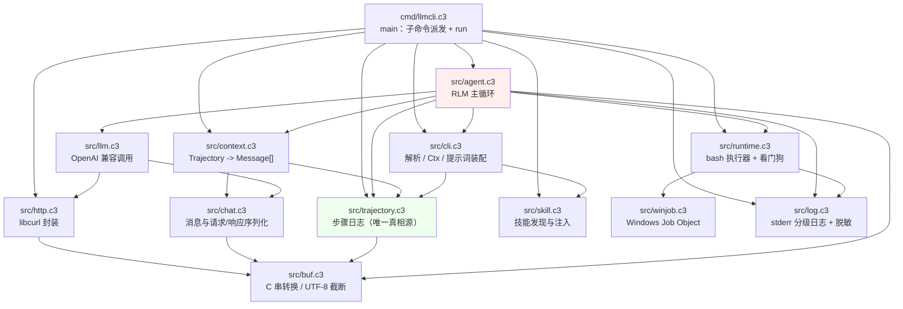
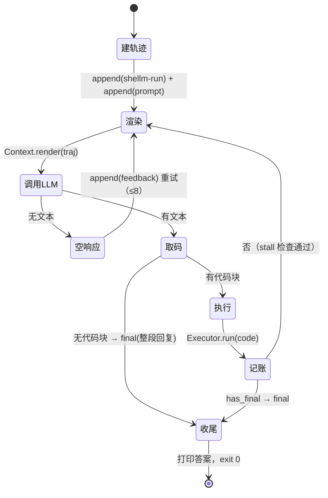

# llmcli 架构设计

本文是 llmcli 的软件架构设计文档，用于指导人与 AI 理解、维护、扩展本仓库。它描述**代码实际
是什么样**：模块边界、运行时数据流、关键接口、内存模型与设计取舍。用法与参数见
[README.md](../README.md) 与 `llmcli --help`；轨迹文件格式见 [sessions.md](sessions.md)；CI 集成见
[ci.md](ci.md)；端点协议字段见 [references/chat-completion-api.md](references/chat-completion-api.md)；
RLM 引擎的目标设计见 [rlm.md](rlm.md)。

> 阅读顺序建议：先读「1. 系统定位」，再读「2. 架构总览」与「3. 一次 run 的生命周期」建立整体
> 图景，然后按需进入「4. 模块设计」。改代码前请连同「5. 设计决策与硬约束」一起看。

---

## 1. 系统定位

llmcli 是一个**单二进制命令行工具**，把 LLM 接进 shell 流水线。核心特征：

- **OpenAI chat completions 兼容**：非流式（`stream:false`）POST `/v1/chat/completions`。
- **shellm 式 RLM agent loop**：一次运行 = 一条 **trajectory**（append-only 步骤日志，唯一真相源）。
  模型回复中包含 ```` ```bash ```` 代码块，本地用 bash 执行，把输出作为下一条 `user` 消息回填，
  循环直到代码里设置 `FINAL` / `FINAL_FILE`，或回复里不再有代码块。
- **messages 是投影不是状态**：每轮由 `Context` 从 `Trajectory` 重新渲染，内存不保存权威副本。
- **bash 是唯一的工具**：不使用 OpenAI `tools` 协议，请求体不带 `tools` 字段。文件读写、构建、
  查询全部由模型写 bash 完成。
- **严格的 stdout/stderr 分离**：stdout 只出最终答案，所有过程日志走 stderr。
- **可控、可脚本化、可审计**：非交互、稳定退出码、每轮生成代码原文打印到 stderr、执行器带三看门狗。

实现语言为 [C3](https://c3-lang.org/)，依赖 `lib/curl.c3l`（libcurl 绑定）与 `lib/cjson.c3l`（JSON）。
`project.json` 定义可执行目标 `llmcli`（源 `src/**` + `cmd/llmcli.c3`）与测试源 `test/**`。

---

## 2. 架构总览

### 2.1 分层与依赖

代码是单向依赖的有向无环图，无环、无全局可变业务状态（日志/信号的少量全局是受控例外）：



- **`cmd` 层**只做编排：子命令派发、日志/信号初始化、动作短路。不含业务逻辑。
- **骨干链路**：`main → agent → {context, trajectory, llm, runtime}`。
- **`trajectory` 是唯一真相源**：`context` 只读它（渲染），`agent` 只写它（append）。
- **侧翼**：`cli`（配置与提示词装配）、`log`、`buf`、`skill` 被多处复用；`skill` 由 `cli` 在装配
  系统提示词时调用，**不参与 RLM 循环**。
- `agent` 依赖 `cli` 只为读 `Ctx` 与退出码常量；`trajectory` 不反向依赖 `agent`/`cli`，保证无环。

### 2.2 模块职责一览

| 文件 | 职责 | 关键接口 |
|------|------|----------|
| `cmd/llmcli.c3` | `main`：子命令派发 → run；动作短路；列出轨迹/skill、`traj`/`context` 子命令 | `main` |
| `src/cli.c3` | `Ctx`、`parse`（纯解析）、`resolve`（补 I/O）、`assemble_system_prompt`、`HELP`、退出码常量 | `resolve`, `parse` |
| `src/agent.c3` | RLM 全部：主循环、`extract_code`（bash + heredoc）、空响应重试、stall guard、子 run fork/merge | `run`, `extract_code` |
| `src/context.c3` | 把 `Trajectory` 渲染成 `Message[]`：head/tail/pin、角色映射、分层截断、`max_bytes`、run 作用域 | `render`, `default_policy` |
| `src/trajectory.c3` | 步骤日志：`Step`/`Trajectory`、append、读回、fork/merge、blob spill、旧格式映射 | `open_new`, `append`, `read_all` |
| `src/llm.c3` | OpenAI 兼容调用入口（组装 system + messages → POST → 解析） | `Llm.call` |
| `src/chat.c3` | `Message`/`ChatResponse` 类型、请求体组装、响应解析、两种消息序列化 | `build_request`, `parse_response` |
| `src/http.c3` | libcurl 生命周期与非流式 POST | `http_init`, `http_post_json` |
| `src/runtime.c3` | 生成代码执行：`Executor`（bash 包装、捕获 `FINAL`、三看门狗、合并/截断输出、中断处理）；保留 `run_python` 备查 | `Executor.run`, `install_interrupt_handler` |
| `src/skill.c3` | 技能发现（`~/.agents/skills` 与 `<cwd>/.agents/skills`）与两种列表组装 | `SkillHub.init/print_installed/print_brief` |
| `src/log.c3` | stderr 四级日志、密钥自动脱敏、仅在 stderr 为 tty 时上色 | `init`, `add_secret`, `info/warn/error/debug` |
| `src/winjob.c3` | Windows Job Object：中断/看门狗时连孙进程一起杀 | `create_and_assign`, `terminate` |
| `src/buf.c3` | 共享小工具：C 串 → String、按 UTF-8 边界截断、`format` | `cstr`, `truncate`, `format` |
| `src/system_prompt.md` | 内置默认系统提示词，`$embed` 编译期嵌入 | — |

---

## 3. 一次 run 的生命周期

### 3.1 控制流

`main`（`cmd/llmcli.c3`）的编排顺序：

1. `configure_dirs(args)`——扫出 `--traj-dir` / `--config-dir` 配置轨迹根（子命令也要认）。
2. `command_index(args)`——第一个命令名参数走子命令派发（`shellm`/`run`/`traj`/`context`/`skills`），
   否则走一次真实运行。
3. 真实运行 `run_entry`：`cli::resolve(args)` → `trajectory::configure` → `log::init` /
   `log::add_secret` → 动作短路（`--help` / 用法错误 / `--list-sessions` / `--list-skills` /
   `--print-system-prompt`）→ `runtime::install_interrupt_handler()` → `http::http_init()` →
   `agent::run(&ctx)`。

### 3.2 RLM 循环状态机

`agent::run(ctx)` 是整套 RLM 逻辑的唯一入口。循环体内的状态：

- `RunState.traj`：本条 trajectory（唯一真相源）。
- `RunState.run_id`：本次 run 的 id（续跑同一轨迹时是新的 run）。
- `RunState.iteration`：从 1 开始的请求计数（与 stderr 的 `[iter N]` 一致）。
- `messages`：**每轮**由 `context::render(traj)` 重建，不跨轮保存。



关键分支（对应 `agent.c3`）：

- **`--max-iterations` 上限**：循环开头判断 `iteration > max_iterations` 即写 `error` 步骤、
  `EXIT_UNCONVERGED`（3），且**本轮不发请求**。`<= 0` 表示不设上限。
- **空响应**（`content` 为空）：追加一条 `feedback`（"继续。"）重试，最多 8 次；耗尽即
  `error` + `EXIT_UNCONVERGED`。这是对齐 shellm `--thinking` 的等价补齐。
- **无代码块**：整段 `content` 即最终答案，写 `final` 步骤，`print_answer` 到 stdout，`EXIT_OK`。
- **多代码块**：只执行第一个，`log::warn` 告警。
- **执行后有 `FINAL`**：写 `final` 步骤，`print_answer(final_answer)`，`EXIT_OK`。
- **stall guard**：连续 5 次非零退出、或同一失败命令重复 3 次 → `error` + `EXIT_UNCONVERGED`。
- **子 run**：本进程若由父进程交代了 `$LLMCLI_PARENT_TRAJ_*`，`run` 结束时在父轨迹写 `merge`。

### 3.3 落盘时机

每个步骤产生即 `trajectory::append`，**整步一次 write、append 原子**：中断/报错后文件末尾永远是
完整步骤，`read_all` 读到的必定是合法前缀。没有"旁路落盘"的概念——trajectory 始终是唯一真相源。

---

## 4. 模块设计

### 4.1 `cli`：配置解析与提示词装配

**`Ctx`** 是一次运行（一条 trajectory 的一次执行）的全部配置，经指针向下传递，**不是全局**。字段
分五类，新增字段必须先归入某一类，避免它退化成"什么都往里塞"的篮子：

| 分节 | 语义 | 代表字段 |
|------|------|----------|
| 初始设置 | 本次运行的固定前提，运行期间不变 | `api_key`, `api_url`, `model`, `config_dir`, `effort` |
| 本次运行边界 | 约束这一次 run 的范围 | `traj_id`, `resume`, `workdir`, `vars`, `max_iterations`, `context_scope`, `max_bytes`, `inactivity_timeout`, `max_output_size`, `max_exec_time`, `system_prompt`, `user_input` |
| 解析中间量 | 只在 parse/resolve 用，agent 一次都不读 | `system_prompt_file`, `input_file`, `prompt`, `traj_dir` |
| 日志开关 | 只影响 stderr，与请求/落盘无关 | `quiet`, `debug`, `no_color` |
| 动作开关 | 决定 main 走哪条路，不改运行配置 | `list_trajectories`, `list_skills`, `print_system_prompt`, `help` |

**两阶段解析**是本模块的核心结构：

- `parse(args, stdin_ok=true) -> ParseResult`：**纯解析，零 I/O**。只看 argv，不读 stdin、不读文件。
  所有与输入来源冲突、缺失、互斥、`traj` 目录名合法性相关的用法错误都在这里报出。动作开关
  （`--help` / `--list-sessions` / `--list-skills` / `--print-system-prompt`）在这里就短路返回，
  **必须在碰 stdin 之前结束**，否则 `llmcli --help` 在终端里会阻塞等输入。子 run 传
  `stdin_ok=false`：它的 stdin 已被父进程接 `/dev/null`，不再算一个输入来源。
- `resolve(args, stdin_ok=true)`：调 `parse` 后补齐运行输入。**唯一的 I/O 发生处**：读
  `--system-prompt-file`、按三选一取 `user_input`（`--input-file` / 位置参数 / stdin 管道）、读不了
  报用法错误、最后装配系统提示词。`resolve` 会保留 parse 定下的每个字段，只填空着的字段（测试
  `test_resolve_keeps_every_parsed_field` 断言了这一点）。

**输入三选一**在 `parse` 里就校验：靠 `io::stdin().isatty()` 判断是否有管道（isatty 只问一句，不
读内容）。`source_count > 1` 或 `== 0` 都是用法错误。

**系统提示词装配**（`assemble_system_prompt`）是唯一一处，`--print-system-prompt` 与真实运行共用，
保证"打印的就是实际会发给端点的内容"：

```
来源（--system-prompt / --system-prompt-file / $embed 的 system_prompt.md）
  → expand_prompt_placeholders（{{date}} / {{cwd}} / {{os}}）
  → inject_skills（追加本机 skill 的 <available_skills> 块）
```

占位符替换用 `DString.replace` 做字节级替换；占位符全为 ASCII，不会命中多字节 UTF-8 字符内部。
`--api-key` / `--model` 必填（不读环境变量兜底），缺失即用法错误。

### 4.2 `agent`：RLM 主循环

**代码块提取 `extract_code`** 是纯函数（无 I/O），行级扫描：

- 围栏行形态：整行以 ``` 开头（含裸 ```、```bash、```sh），或 ```bash / ```sh 缀在散文行末。
- 块内以 ``` 开头的行不作闭块，避免代码里嵌 markdown 时早闭；精确的 ``` 行才闭块。
- **heredoc 感知**：块内 `<<EOF` / `<<-EOF` / `<<'EOF'` 开一段，直到分隔符行结束，其间 ``` 不闭块。
- 只收集第一个块；闭块后再出现围栏只置 `truncated`。`Extract` 用 `has_code` 与 `code` 区分"没有
  代码块"与"空代码块"（后者 `has_code=true`、`code=""`）。
- 返回的 `code` 在 `mem` 上，由调用方释放。工具标记归一化（Qwen `<tool_call>`）未做——后置。

**空响应重试**：`content` 为空时追加一条 `feedback`（"继续。"）再请求，最多 8 次；耗尽即 `error`。
这是对齐 shellm `--thinking` 的等价补齐（模型可能把预算花在思维链上）。

**stall guard**：连续 5 次非零退出、或同一失败命令重复 3 次 → `error` 步骤 + 退出码 3。

**子 run**：本进程若由父进程交代了 `$LLMCLI_PARENT_TRAJ_DIR` / `$LLMCLI_PARENT_TRAJ_ID`，`run` 开头
在父轨迹写 `fork`、结束时写 `merge`；自己的轨迹也放进父轨迹根目录。

**内存策略**（见 `agent.c3` 顶部注释）：消息是投影不是状态——每轮从 trajectory 重渲染，进度不保存
在内存；每轮临时数据走 `tmem`，由循环上的 `@pool()` 回收。轨迹坐标（root/name/id/path）拷到 `mem`，
活过整个 run。

### 4.3 `context`：Trajectory -> Message[]

`context::render(alloc, traj, policy)` 是 `Trajectory` 的唯一消费者（渲染侧）。`RenderPolicy` 默认：

- 角色映射：`reasoning`/`final` → assistant，`prompt`/`shell-output`/`feedback` → user；
  `shellm-run`/`run-summary` 排除（永不进上下文）。
- 窗口：`head`（默认 1）+ `tail`（默认 50）+ `pins`；尾窗起点按 `tail_block` 对齐。
- **分层截断**：`prompt` 类永不截断（`full_types`）；普通步骤用 `prompt_limit`（2048），最新波段用
  `block_limit`（8192）；超限时中间截断、保留首尾、打 `[... truncated: N bytes total ...]` 桩。
- `max_bytes`：总量超预算时折半收紧 `limit` 至下限。
- `run`：非空时只保留该 run 的步骤（`--context-scope run`）。
- `reasoning_content` 字段**不参与渲染**——它只入存档、绝不回传端点。

### 4.4 `trajectory`：唯一真相源

- 目录 `<root>/<hex8>-<slug>/trajectory.jsonl`；`root` 优先级 `--traj-dir` → `<config-dir>/traj` →
  `~/.llmcli/traj`，只由命令行决定，不读环境变量。
- 首行是头 `{"type":"trajectory"}`；其后每行一个 `Step`，**整步一次 write、append 原子**。
- 大字段（超 8 KiB）spill 到 `blobs/<step_id>-<field>.blob`，步骤里存 `<field>_ref` + `<field>_bytes`。
- `fork` 写 `{type:fork,child,slug}` 返子 id；`merge` 写 `{type:merge,from_traj}`。
- **旧会话格式**（`{ts,turn,message}` 行）读取时映射为 `prompt`/`reasoning` 步骤，不强制迁移。

### 4.5 `chat`：消息与序列化

**`Message`** 只有 `role` / `content` / `reasoning` 三字段；RLM 循环实际只产生 `system` / `user` /
`assistant` 三类角色。

**两条序列化路径必须分开**，这是安全与协议正确的关键：

- `message_to_request_json`（回传端点）：**不带** `reasoning_content`（DeepSeek 等端点收到会报错）。
- `message_to_archive_json`（存档）：**带** `reasoning_content`。

`build_request` 组装请求体：`model`、`messages`，并用 `cjson::add_false_to_object(root, "stream")`
写 `stream:false`。**不能用 `set("stream", false)`**——cJSON 的 `cJSON_bool` 是 int，与 C3 `bool`
宽度不同，走 C 变参会得到 `true`。请求体**不含 `tools`**。

`parse_response` 解析 `choices[0].message.{content, reasoning_content}` 与
`choices[0].finish_reason`，并把 `usage` 的 token 数拼成展示串；任一必需结构缺失即 `ok=false` 并
给出原因。

### 4.6 `llm`：OpenAI 兼容调用

`Llm.call(system_prompt, messages)` 是统一入口：把 system 拼到 messages 最前，复用 `chat.c3` 的
`build_request`/`parse_response` 与 `http.c3` 的 `http_post_json`。只做 OpenAI chat completions 兼容，
**不做 provider 抽象**。密钥由 `log` 统一脱敏。

### 4.7 `runtime`：bash 执行器

`Executor.run(code)` 的执行模型（对齐 shellm）：

1. 在临时目录生成脚本 `llmcli_script_<ts>.sh`，**模型代码原样嵌入、零转义**。
2. 包装：`set -e` → 可选 `cd <workdir>` → `export <--var>` → `set -x` → 模型代码 → `set +x` →
   `set +e` → 按"是否设置"捕获 `FINAL_FILE`（优先）/ `FINAL` 到 `final_path` → `exit 原 rc`。
3. 定位 bash：Windows 用 Git Bash（常见安装路径，回退 PATH），POSIX 用 `/bin/bash`。
4. `process::spawn` 开 `INHERIT_ENV`（否则模型代码找不到 PATH）；子进程 stdin 关掉（等效 `/dev/null`，
   交互式命令立即 EOF）。
5. **三看门狗**（独立线程，只用原子量——线程里不能用 `tmem`）：
   - 空闲：无输出超 `inactivity_timeout` 秒 → 杀，附「疑似交互」结构化反馈；
   - 输出量：累计超 `max_output_size` 字节 → 杀；
   - 墙钟：运行超 `max_exec_time` 秒 → 杀。
   Windows 上关 Job 句柄即杀整棵进程树（否则孙进程仍持有管道，主线程的 read 不返回 EOF）。
6. **stdout 在本线程读、stderr 交给工作线程**，两边都不堵管道才不会死锁。输出缓冲绑
   `LIBC_ALLOCATOR`（脱离 `@pool`，因为会在工作线程增长）。
7. 合并输出后**剥离 xtrace 行**（`^+ ` 前缀）；超 2000 行截断为末 2000 行，完整输出落临时文件并把
   路径写进回填文本；非零退出码附加 `[exit N]`。
8. 读回 `final_path`（若存在）作为 `final_answer`，`has_final=true`。

**中断处理**：`active_child`（当前子进程）与 `active_job`（Windows Job 句柄）是 `runtime` 的全局，
**不能是 tlocal**——Windows 上信号处理器跑在另一个线程。`on_interrupt` 先杀子进程再 `exit(130)`。

`run_python` 作为**可选实现保留备查**（Python 包装与 bash 同构）；主循环默认走 `run_bash`。

### 4.8 `skill`：技能发现与注入

技能即一个目录，内含 `SKILL.md`（front matter 给 `name`/`description`，其后是正文）。

- 发现两处：全局 `~/.agents/skills/<name>/` 与项目 `<cwd>/.agents/skills/<name>/`；`load_dirs`
  按顺序加载，**项目级后加载覆盖全局级同名技能**。
- `name` / `description` / 正文三者非空才算有效 skill；按 name 升序排序（插入排序，数量小）。
- 两种产出：`print_installed`（拼进系统提示词的 `<available_skills>` 块，name/description/location
  均做 XML 转义，路径统一成正斜杠）与 `print_brief`（`--list-skills` 的人读简表）。
- 无 skill 时 `print_installed` 返回空串，系统提示词不留任何噪音。
- llmcli 里 bash 是唯一工具，所以注入文本让模型用 bash 读 `SKILL.md`，而不是内置 ReadFile 工具。

### 4.9 `http`：libcurl 封装

`http_init/http_deinit` 管理 curl 全局生命周期。`http_post_json` 完成一次非流式 POST：写回调把响应
体追加到绑 `LIBC_ALLOCATOR` 的 sink（增长发生在 libcurl 的 C 回调里，不能绑 `@pool`）；URL 与
header list 的生命周期需覆盖 `perform`；body 用 `COPYPOSTFIELDS` 让 libcurl 自复制。返回
`HttpResponse{status, body, error}`，传输失败时 `error` 非空、`status` 为 0。

### 4.10 `log`：日志与脱敏

`log` 是 stderr 的**唯一出口**。核心不变量：

- 密钥在 `main` 里 `add_secret` 注册一次，之后所有日志输出前自动 `redact`——调用方不必记得手动
  脱敏，直接打原文即可。脱敏形如 `sk-1234 → sk-***234`，短于 6 位全遮。
- 四级：`error`（quiet 也出）/ `warn` / `info` / `debug`；颜色只在 stderr 是 tty 且未加
  `--no-color` 时输出。
- 这是"未来换 logger 模块"的唯一替换点。

---

## 5. 设计决策与硬约束

这些是代码注释反复强调的取舍，改坏了会让回归挂掉。

### 5.1 行为与协议

- **`parse()` 纯解析，I/O 只在 `resolve()`**：动作开关与用法错误都必须在碰 stdin 前结束，否则在
  终端里阻塞。`--input-file` 指向不存在的文件时，也应先报输入来源冲突而不是先打开文件。
- **RLM 不用 tools 协议**：请求体不带 `tools`；bash 是唯一工具。
- **`reasoning_content` 只入存档、绝不回传端点**：`chat` 的 request / archive 两条序列化路径已分开；
  轨迹里存 `reasoning_content`，但 `context::render` 不读它。
- **`FINAL` / `FINAL_FILE` 按"是否设置"判断，不按真假值**：`FINAL=""` 也算设置过（空答案收尾）；
  `FINAL_FILE` 优先于 `FINAL`。bash 包装用 `[ -n "${FINAL+x}" ]` 表达。
- **无代码块的回复即最终答案**：单轮问答走这条兜底。

### 5.2 执行与落盘

- **生成代码统一经子进程 bash 执行**：Windows 用 Git Bash（常见路径、回退 PATH），POSIX 用
  `/bin/bash`；`INHERIT_ENV` 保证子进程有 PATH；stdin 关掉（等效 `/dev/null`）。
- **三看门狗**：空闲 / 输出量 / 墙钟；看门狗跑独立线程，**只用原子量，不能用 `tmem`**（线程本地）。
- **输出合并 stdout+stderr，剥离 xtrace 行，超 2000 行截断为末 2000 行**，完整输出落临时文件并给出路径。
- **每个步骤产生即 append**（整步一次 write）：中断/报错后文件末尾永远是完整步骤。
- **轨迹根目录只由命令行决定**（`--traj-dir` / `--config-dir`），不读任何环境变量。

### 5.3 内存模型

C3 的内存分配器选择是显式的，本项目用到三种，用途不可混：

| 分配器 | 生命周期 | 用于 |
|--------|----------|------|
| `mem` | 进程生命周期（长期数据） | 轨迹坐标、轨迹读回、系统提示词、最终答案、执行输出的 mem 副本 |
| `tmem` | 随 `@pool()` 回收（per-iteration scratch） | 每轮请求体、渲染中间量、临时格式化、路径拼接 |
| `LIBC_ALLOCATOR` | 显式 `free`，脱离 pool/context | 跨线程增长的输出缓冲、libcurl 回调 sink、stdin 读取 |

规则：跨线程/回调增长的缓冲必须绑 `LIBC_ALLOCATOR`，且**在线程启动前 init**（避免 DString 零值
惰性初始化落到工作线程的 `tmem`）。`mem` 堆串由返回方持有，调用方负责释放。**看门狗线程只能用原子量**：
`tmem` 是线程本地的，新线程上分配会崩。

---

## 6. 平台与运行时差异

- **验证范围**：v1 只在 Windows/x64 上验证，Linux/macOS 是兼容目标而非验证目标。核心链路只用
  可移植 API。
- **唯一的平台专有依赖**是 Windows Job Object（`src/winjob.c3`，`$if env::WIN32` 门控），用于
  Ctrl+C 时连孙进程一起杀。理由：靠控制台事件杀孙进程不可靠（`ping` 收到 `CTRL_BREAK` 只打印统计
  然后继续跑），而 `KILL_ON_JOB_CLOSE` 关句柄即杀整棵进程树。POSIX 上它是未被引用的死代码。
- **信号**：Windows 上 `Ctrl+C` 走 `SIGINT`、`Ctrl+Break` 走 CRT 的 `SIGBREAK`（不是 `SIGTERM`）；
  POSIX 上 `Ctrl+C` 走 `SIGINT`、CI 的 `timeout` 默认发 `SIGTERM`。POSIX 只 terminate 直接子进程
  （进程组 kill 需要 spawn 前 `setpgid`，v1 不做）。
- **bash 定位**：见 4.7。`lib/curl.c3l` 只带 windows-x64 预编译 libcurl（linux/macOS 链系统
  curl）；`lib/cjson.c3l` 在 windows-x64 用预编译 .lib，其它平台编译自带 C 源码。

---

## 7. 错误、退出码与可观测性

**退出码**（常量在 `cli.c3`，同时写入 `HELP`）：`0` 成功；`1` 网络/API/协议错误；`2` 用法/参数错误；
`3` 循环未收敛；`130` 被使用者中断。

**错误传播**：模块间用两种约定——可恢复的用法/解析错误走 `ParseResult.error`（字符串非空即错误，
`main` 打印并返回 2）；运行时错误走返回值字段（`llm::Response.error`、`HttpResponse.error`、
`ExecResult.exit_code`），由 `agent` 汇总为 `log::error` + `error` 步骤 + 对应退出码。C3 的 `!` /
`catch` 用于文件、进程等可失败调用。

**可观测性**：v1 是 stderr 人类可读打印，入口集中在 `log`。每轮打印 `[iter N]` 摘要（耗时、
reasoning 字符数、token 用量）；`--debug` 额外打印原始请求/响应（截断、密钥脱敏）；每轮执行的
生成代码原文都打印到 stderr 供审计。

---

## 8. 验证架构

| 层 | 位置 | 覆盖 |
|----|------|------|
| 单元测试 | `test/*_test.c3`（`c3c test`） | `extract_code`（bash + heredoc）、`cli` 解析/resolve、`chat` 序列化与解析、`context` 渲染策略、`trajectory`（append/读回/fork/merge/spill/旧格式）、`skill`、`buf` |
| 端到端回归 | `scripts/regress.py` + `scripts/mock_llm.py` | 真实二进制对着**离线 mock 端点**跑完整 run：stdout 纯净度、退出码、轨迹落盘、子 run fork/merge、空闲看门狗、中断、`--max-iterations`、`traj`/`context` 子命令 |

`scripts/mock_llm.py` 是本地 mock OpenAI 服务，按"脚本"依次返回各轮模型回复；内置 scenario
覆盖单轮、bash 代码循环、设置 FINAL、读改文件、reasoning、坏 JSON、HTTP 500、空答案、慢命令、
空闲命令、子 run、同一轨迹两轮代码、永不收敛等。回归对 stdout 纯净度与"已生成代码 100% 在 stderr
可见"有断言。

**约定**：复现某种 LLM 行为时，在 `mock_llm.py` 加 scenario，不要改 `regress.py` 去适配。
回归不碰真实端点、无需 API key，但需先 `c3c build`。

---

## 9. 扩展指南

- **新增/修改 CLI 行为**：先改 `src/cli.c3` 的 `parse` 与 `HELP`，再让 `resolve` 补齐 I/O，最后动
  `agent` / `runtime`。`Ctx` 新字段必须先归入五节之一。
- **行为变更同步文档**：`src/cli.c3` 的 `HELP`、`README.md`、`docs/` 三处同步——`--help` 就是产品
  文档。
- **改请求/响应解析前**：查 `references/chat-completion-api.md`，不要凭记忆写字段名。
- **加新模块**：`context` 只读 `trajectory`，`agent` 只写 `trajectory`；保持这一单向依赖，别让
  `trajectory` 反向依赖 `agent`/`cli`。
- **加新平台**：先确认 `winjob` 门控与 bash 定位路径；`http`/`cjson` 的链接方式见 `lib/*.c3l` 的
  平台分支。
- **未来方向（非 v1）**：SSE 流式输出、`--stop-after-code-block`、代理与自定义 header、独立 logger
  模块、生成代码沙箱（`SandboxExecutor`，接口不变）、`mem` 持久记忆。

---

## 10. 术语表

| 术语 | 含义 |
|------|------|
| **RLM** | Recursive Language Model，这里指"模型写代码 → 本地执行 → 输出回填"的循环范式。 |
| **run** | 一次 `Agent.run`，即一条 trajectory 的一次执行（有自己的 `run_id`）。 |
| **iteration** | run 内的一次 LLM 往返；与 stderr 的 `[iter N]` 一致。 |
| **trajectory** | append-only 的步骤日志，run 的唯一真相源；文件 `<hex8>-<slug>/trajectory.jsonl`。 |
| **step** | trajectory 里的一条记录（prompt/reasoning/shell-output/final/…）。 |
| **context** | 从 trajectory 渲染出的 messages 投影（`context::render`）。 |
| **sub-run** | 生成代码显式起的子进程 run，在父轨迹上是 fork/merge 分支。 |
| **FINAL / FINAL_FILE** | 生成代码里设置完成信号的变量，分别表示以字符串/文件内容作为最终答案。 |
| **Observation** | 代码执行输出，作为下一条 `user` 消息回填给模型（shellm 的 shell-output 语义）。 |
