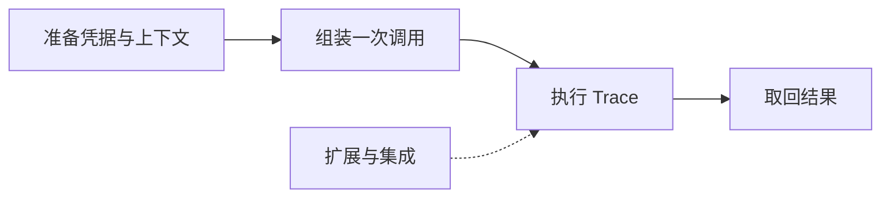

# llmcli 命令行工具 PRD

> 版本：v0.3（补充 `reasoning_content` 要求） | 日期：2026-09-14 | 状态：草稿 | 作者：（待填） | 评审人：yuekcc

摘要：为需要把 LLM 接入 shell 流水线的开发者/脚本作者，解决"缺少可控、可脚本化、可审计的本地 LLM 调用入口"的问题，达成"一条命令完成 输入 →（多轮工具）推理 → 干净 stdout 输出"的目标。

## 背景与目标

**背景**：本仓库（mp-next）当前只有工程骨架：target `llmcli` 已配置，`cmd/llmcli.c3` 为 6 行 stub，`src/` 为空；依赖 `lib/curl.c3l`（libcurl 绑定，含 `CurlWriteCallback`）与 `lib/cjson.c3l`（JSON 解析）已就位，c3c 0.8.4 + LLVM 后端可用。现状下要与 LLM 交互只能手写 `curl` + `jq` 脚本，无法承载多轮工具调用，也不可复用。

**目标**：交付单二进制 CLI `llmcli`——OpenAI chat completions 兼容、内置 agent loop（Trace/Turn 语义）、stdout/stderr 严格分离、`--session-id` 本地落盘续话。

**成功指标**：

| 指标 | 基线 | 目标值 | 时间窗 | 数据来源 |
|------|------|--------|--------|----------|
| 端到端可用性 | 无（仅手写 curl） | S1–S4 对应 mock 回归场景全绿 | v0.1.0 发布前 | `test/**` 测试套件 + `scripts/mock_llm.py` |
| stdout 纯净度 | — | 自动化断言 100% 通过（stdout 无任何日志行） | 同左 | 测试套件 |
| 工具循环任务成功率 | 0（无工具） | mock"读文件→改文件"任务 N=20 次运行成功率 ≥ 90% | 同左 | 回归脚本 |
| 首次成功调用耗时 | — | 新用户从读 `--help` 到跑通 < 5 分钟 | 同左 | 人工验收 |
| 可审计性 | — | 100% 工具调用（命令行/文件改动）在 stderr 可见 | 同左 | 人工验收 |
| 思维链可追溯 | 无（丢弃 `reasoning_content`） | 含 `reasoning_content` 的 mock 响应 100% 落盘，且 stdout 无泄漏、续话请求中已剥离 | 同左 | 测试套件 |

## 范围与约束

**包含**：CLI 单二进制；`tmp/1.md` 所列 flags（新增 `--help/--quiet/--debug/--no-color` 等）；prompt / stdin / `--input-file` 三选一输入；OpenAI chat completions 兼容端点；非流式（`stream:false`）；agent loop（Trace/Turn）；工具接口 + 注册表；Bash、EditFile 两个内置工具；`--session-id` 本地落盘续话（含 `reasoning_content` 全量落盘）；退出码约定（0/1/2/3）；stderr 过程日志（无 logger 模块）。

**不包含**：库/SDK 形态；GUI/TUI；多 provider 协议（Anthropic 等）；SSE 流式输出（列入 S5）；限制类机制与开关（超时、输出截断、失败阈值，列入 S5；turn 上限已以 `--max-turns` 落地）；完整 logger 框架；密钥托管/加密；工具市场或远程工具。

**假设与已定决策**（标注"已确认"的为 2026-09-14 评审确认，其余仍需评审）：

1. `tmp/1.md` 的 `stop_reason` 在 OpenAI 协议中即 `finish_reason`：值为 `tool_calls` 时继续循环，`stop` 时结束。
2. 输入互斥：`<some_user_prompt>` / stdin / `--input-file` 严格三选一（已确认；`tmp/1.md` 示例已同步改写）。
3. `--api-key` 必填（已确认）：不提供环境变量兜底；缺失即用法错误（退出码 2），不发网络请求；密钥在 stderr 一律脱敏。
4. `--model` 必填；`--api-url` 默认 `https://api.openai.com/v1/chat/completions`（已确认）。
5. 退出码（已确认，细分）：0 成功；1 网络/API/协议错误；2 用法/参数错误；3 循环未收敛（turn 超限/连续失败/无最终答案）。
6. **限制类机制默认不加（已确认）**：默认不设 turn 上限、不设 HTTP/命令超时、工具输出不截断、不设连续失败阈值；失控保护依赖使用者 Ctrl+C 与外部超时工具（CI）。其中 turn 上限已作为 `--max-turns` 落地（不传或 <=0 即不设上限，见 T3.7），其余开关与强制逻辑仍排入 S5。
7. 会话落盘（已确认）：路径 `~/.llmcli/sessions/<id>.jsonl`（Windows 为 `%USERPROFILE%\.llmcli\sessions`），可用 `LLMCLI_HOME` 覆盖；一行一条 JSON（含 `ts`/`turn`/`message`）；**全量记录** user/assistant/tool 三类消息，工具输出原样入库；**不提供清理功能（已确认）**，docs 说明文件位置与手动删除方式。
8. `reasoning_content` 处理（本次补充）：兼容端点（如 DeepSeek 系模型）的 assistant 消息可能带 `reasoning_content`。**全量落盘**（保留原字段名与内容）；组装后续请求时**剥离该字段**（DeepSeek 等明确要求不得回传，回传可能报错）；stderr 默认只打印长度摘要、`--debug` 打印全文；stdout 永不出现。
9. 平台范围（已确认）：v1 仅在 Windows/x64 上验证；实现不得依赖平台专有 API，兼顾 Linux（路径分隔符、TTY 检测、子进程等待差异在 S1/S2 一并处理）。
10. `--help` 输出到 stdout、退出码 0；参数错误时用法提示到 stderr、退出码 2。

**依赖**：c3c ≥ 0.8.4；`lib/curl.c3l`、`lib/cjson.c3l`（windows-x64 为预编译库，linux/macos 走系统 curl / C 源码）；回归验证依赖 `scripts/mock_llm.py`（本地 mock OpenAI 服务，可脚本化返回多轮 `tool_calls`）。

**风险**：

| 风险 | 影响 | 缓解 |
|------|------|------|
| Bash 工具默认放行（已确认接受） | 提示注入/LLM 误判可致任意命令执行 | 每次调用与命令原文打印到 stderr 可审计；`--help`/docs 显式警示；S5 可用 `--allow-exec`、命令白名单收紧 |
| 默认不设限制（`--max-turns` 可止损；已确认接受） | LLM 打转或工具连环失败会持续烧 token；HTTP/命令可永久挂起；工具大输出可能撑爆上下文导致 API 报错；会话文件随全量落盘且不清理持续膨胀 | 可用 `--max-turns` 在 n 次请求后止损（stderr 说明、stdout 空、退出码 3）；每轮 turn 摘要实时打印在 stderr，便于及时 Ctrl+C；CI 用外部超时包裹；docs 警示长输出场景与手动删除会话文件；S5 恢复 `--timeout`/截断/失败阈值开关 |
| libcurl 绑定能力/平台差异 | 请求失败或 Linux 兼容问题 | S1 先做最小请求冒烟；v1 仅在 Windows/x64 验证（已确认），代码不依赖平台专有 API，为 Linux 留出余地 |
| 会话文件并发写 | 历史损坏 | 追加原子写 + 检测；损坏行跳过并警告（S3） |
| 会话/日志含对话内容、思维链（`reasoning_content`）与完整工具输出，可能含敏感数据 | 隐私泄露 | 文件禁止存 key；docs 说明文件位置与手动删除方式；`--quiet` 不改变落盘，需文档明示 |

**非功能**：

- 性能：瓶颈是网络与 LLM 延迟；CLI 启动与解析开销应无感（不做硬性指标）。
- 安全：密钥不落盘、日志脱敏；EditFile 仅在用户有权路径生效；Bash 风险已接受并记录。
- 可观测性：v1 为 stderr 人类可读打印，日志入口集中在一处，为后续 logger 模块预留替换点；`reasoning_content` 默认以长度摘要出现在 stderr，`--debug` 可看全文。
- 成本：stderr 打印每轮 token 用量（API 返回 `usage` 时）。
- 可移植：v1 验证范围仅 Windows/x64（已确认）；实现避开平台专有 API（路径分隔符、TTY 检测、子进程等待属跨平台敏感点），Linux 作为兼容目标而非验证目标。

## 故事地图

**核心流程**：

**活动描述**：

- **A1 准备凭据与上下文**
  - **T1.1 提供 API 凭据**
    - As a 脚本作者, I want 用 `--api-key` 提供密钥, so that 每次调用显式声明凭据，来源清晰可控
      - AC: Given 未传 `--api-key`, When 运行, Then 退出码 2、stderr 提示缺失、不发任何网络请求，且不读取任何环境变量（已确认无 env 兜底）
      - AC: Given 提供 `--api-key`, When 运行, Then 请求携带该密钥，且 stderr 只显示脱敏形式（如 `sk-***abc`）
      - 优先级/切片：Must / S1 ｜ 依赖：无
  - **T1.2 指定端点与模型**
    - As a 使用者, I want `--api-url` 与 `--model` 可配置（`--api-url` 有默认值）, so that 官方与兼容端点都能用
      - AC: Given 未传 `--api-url`, When 运行, Then 请求发往默认 `/v1/chat/completions`
      - AC: Given 未传 `--model`, When 运行, Then 退出码 2 并提示 `--model` 必填
      - 优先级/切片：Must / S1 ｜ 依赖：无
  - **T1.3 注入 system prompt**
    - As a 使用者, I want `--system-prompt` 与 `--system-prompt-file` 两种方式, so that 短提示词随手写、长提示词放文件
      - AC: Given 二者同时给出, When 运行, Then 退出码 2（互斥）
      - AC: Given `--system-prompt-file` 指向不存在的文件, When 运行, Then 退出码 2 且 stderr 指明路径
      - AC: Given 只给其一, When 请求发出, Then `messages[0]` 为 `role=system` 且内容与来源一致
      - 优先级/切片：Must / S1 ｜ 依赖：无
  - **T1.4 会话标识**
    - As a 使用者, I want `--session-id` 标识一个会话, so that 同一会话可跨调用累积
      - AC: Given S1 阶段传入 `--session-id`, When 运行, Then stderr 的 Trace 行包含该 id（暂不落盘）
      - AC: Given S3 阶段同一 id 二次调用, When 运行, Then 历史被加载并参与请求（见 T5.2）
      - 优先级/切片：Must / S1（标签）→ S3（落盘） ｜ 依赖：T5.2

- **A2 组装一次调用**
  - **T2.1 位置参数 prompt**
    - As a 脚本作者, I want 用位置参数直接传 prompt, so that 一行命令即可发起问答
      - AC: Given `llmcli --model m --api-key k "你好"`, When 运行, Then 请求 user message 内容为 `你好`
      - AC: Given prompt 含空格/引号/中文, When 运行, Then 原样传递，不截断、不转义破坏
      - 优先级/切片：Must / S1 ｜ 依赖：无
  - **T2.2 stdin 管道输入**
    - As a 脚本作者, I want 从 stdin 读输入, so that `cat x.md | llmcli ...` 可用
      - AC: Given 存在管道输入且未给位置参数/`--input-file`, When 运行, Then user message 为管道输入全文
      - AC: Given stdin 为终端（无管道）且无其它输入, When 运行, Then 退出码 2 提示需要输入，不阻塞等待
      - 优先级/切片：Must / S1 ｜ 依赖：无（注意 Windows 下 tty 检测）
  - **T2.3 `--input-file`**
    - As a 使用者, I want `--input-file` 指定输入文件, so that 长素材不必走管道
      - AC: Given 文件存在, When 运行, Then user message 为该文件全文（UTF-8）
      - AC: Given 文件不存在/不可读, When 运行, Then 退出码 2 且 stderr 指明路径
      - 优先级/切片：Must / S1 ｜ 依赖：无
  - **T2.4 输入来源互斥校验**
    - As a 使用者, I want prompt / stdin / `--input-file` 严格三选一, so that 不会因隐式合并产生意外请求
      - AC: Given 任意 ≥2 个来源同时出现, When 运行, Then 退出码 2，stderr 列出冲突来源，不发起网络请求
      - AC: Given `tmp/1.md` 原示例（`--input-file` 与位置参数并存）, When 运行, Then 报用法错误（示例需修正为三选一）
      - 优先级/切片：Must / S1 ｜ 依赖：无
  - **T2.5 `--help` 与用法提示**
    - As a 新用户, I want `--help` 列出全部 flags 与典型示例, so that 不用读源码
      - AC: Given 运行 `--help`, When 输出, Then 用法、flags、退出码表与示例出现在 stdout，退出码 0
      - AC: Given 参数错误, When 输出, Then 用法简报到 stderr，退出码 2
      - 优先级/切片：Should / S4（最小版可随 S1 落地） ｜ 依赖：退出码表定稿

- **A3 执行 Trace**
  - **T3.1 发起非流式 chat completion**
    - As a 使用者, I want 一次调用即一个 Trace, so that 排查与计费可控
      - AC: Given 合法输入, When 运行, Then 向 `--api-url` POST JSON：`model`、`messages`、`stream=false`，工具启用时附 `tools`
      - AC: Given 网络错误或非 2xx 响应, When 失败, Then stderr 打印状态码与响应摘要（截断），退出码 1，stdout 为空
      - 优先级/切片：Must / S1 ｜ 依赖：无
  - **T3.2 解析响应**
    - As a 使用者, I want 正确识别 `content` / `tool_calls` / `finish_reason`, so that 循环能按协议推进
      - AC: Given `choices[0].message.content` 非空且 `finish_reason=stop`, When 运行, Then 该 content 作为最终答案
      - AC: Given `finish_reason=tool_calls` 且 `message.tool_calls` 非空, When 运行, Then 进入工具执行分支，不把 content 当答案
      - AC: Given 响应非法 JSON 或缺关键字段, When 运行, Then 退出码 1，stderr 打印原始响应（截断）
      - AC: Given assistant 消息含 `reasoning_content`, When 解析, Then 该字段被捕获并纳入落盘路径，且绝不出现在 stdout（见假设 8）
      - 优先级/切片：Must / S2 ｜ 依赖：T3.1
  - **T3.3 Turn 循环（Trace 语义）**
    - As a 使用者, I want agent loop 按 turn 推进且每轮在 stderr 可见, so that 我能审计 LLM 的每一步决策
      - AC: Given turn n 返回 `tool_calls`, When 工具执行完成, Then 以 `role=tool`（含 `tool_call_id`）追加结果并进入 turn n+1
      - AC: Given `finish_reason=stop`, When 到达, Then 循环终止，最终文本进 stdout
      - AC: Given 默认运行（未 `--quiet`）, When 每轮完成, Then stderr 打印一行摘要：turn 序号、工具名、参数摘要、结果状态、耗时（响应含 `reasoning_content` 时附其字符数）
      - 优先级/切片：Must / S2 ｜ 依赖：T3.2、T3.4
  - **T3.4 工具接口与注册表（稳定扩展点）**
    - As a 后续开发者, I want 工具经统一接口接入注册表, so that 新增工具不改动循环逻辑
      - AC: Given 新增一个工具（name、description、参数 JSON Schema、execute 实现）并注册, When 运行, Then LLM 可调用它，且 agent loop 代码零改动
      - AC: Given 无已注册工具, When 运行, Then 请求不带 `tools` 字段，行为退化为单轮问答
      - AC: Given 需要新增工具, Then `docs/` 中存在一页可照抄的接入示例
      - 优先级/切片：Must / S2 ｜ 依赖：无
  - **T3.5 Bash 工具（默认放行，已确认）**
    - As a 使用者, I want LLM 能执行 shell 命令并回填结果, so that 构建、查询、校验类任务可自动完成
      - AC: Given 工具调用 `command="ls"`, When 执行, Then 回填完整 stdout/stderr 与退出码（v1 不截断，已确认；长输出风险见风险表）
      - AC: Given 命令长时间不退出, When 使用者 Ctrl+C（或 CI 外部超时）, Then 子进程被一并终止无残留，stdout 为空，退出码非 0（v1 无内置超时）
      - AC: Given 默认放行的风险, When 任一命令执行, Then 命令原文打印到 stderr（可审计），且 `--help`/docs 含风险警示
      - 优先级/切片：Must / S2 ｜ 依赖：T3.4
  - **T3.6 EditFile 工具**
    - As a 使用者, I want LLM 能读取并修改文件, so that 改代码/写文件可自动完成
      - AC: Given `old` 文本在目标文件中唯一匹配, When 执行, Then 完成替换并回填 diff 摘要
      - AC: Given 匹配不唯一/不存在/无权限, When 执行, Then 回填错误文本给 LLM，不崩溃、不写坏文件
      - AC: Given Windows 路径与 UTF-8 中文内容, When 执行, Then 行为与 POSIX 一致
      - 优先级/切片：Must / S2 ｜ 依赖：T3.4
  - **T3.7 失控保护与开关（`--max-turns` 已落地，其余 S5）**
    - As a 使用者, I want 能限制 turn 数（最终还要能限制超时、输出长度与失败次数）, so that 失控时能自动止损
      - AC: Given 不传 `--max-turns` 或传 <=0, When LLM 持续返回 `tool_calls`, Then 循环持续直到 API 错误或使用者中断（Ctrl+C）
      - AC: Given `--max-turns n`（n>0）, When 即将发起第 n+1 次请求, Then 终止循环、stderr 说明原因、stdout 为空、退出码 3
      - AC: Given `--max-turns` 收到非整数, When 运行, Then 退出码 2 且 stderr 指明该参数
      - AC: Given S5 引入 `--timeout/截断/失败阈值`, When 达到限制, Then 终止循环、stderr 说明原因、stdout 为空、退出码 3
      - 优先级/切片：Must / S5（`--max-turns` 已实现，其余仍为 S5） ｜ 依赖：T3.3
  - **T3.8 工具错误回填**
    - As a 使用者, I want 工具失败以错误文本回填给 LLM, so that LLM 能自我修正而非直接失败
      - AC: Given 工具名未知 / 参数 JSON 非法 / 缺必填参数, When 执行, Then 回填结构化错误并进入下一轮，且该错误文本绝不出现在 stdout
      - AC: Given 同一工具连续失败（v1 不设阈值，已确认）, When 运行, Then 持续回填错误直至 LLM 收敛或使用者中断；S5 引入阈值后按 T3.7 处置
      - 优先级/切片：Must / S2 ｜ 依赖：T3.3

- **A4 取回结果**
  - **T4.1 stdout 纯净输出**
    - As a 脚本作者, I want stdout 只包含最终答案, so that 结果可直接 `| jq` 或重定向
      - AC: Given 含工具调用的多轮运行, When 成功, Then stdout 仅最终 assistant 文本，无任何日志行
      - AC: Given 运行失败, When 终止, Then stdout 为空
      - 优先级/切片：Must / S1 ｜ 依赖：无
  - **T4.2 stderr 过程日志**
    - As a 使用者, I want 过程信息走 stderr, so that 管道数据不被污染
      - AC: Given 默认运行, When 结束, Then stderr 含 Trace 起止、每轮 turn 摘要、token 用量（若 API 返回）、错误详情
      - AC: Given `--quiet`, When 运行, Then stderr 只保留错误；Given `--debug`, Then 额外打印原始请求/响应（密钥脱敏；仅为可读性截断展示，与工具输出策略无关）
      - AC: Given 响应含 `reasoning_content`, When 默认运行, Then stderr 只打印长度摘要；Given `--debug`, Then 打印全文；任何情况下均不写入 stdout
      - 优先级/切片：Must（基础）/ S1；分级 / S4 ｜ 依赖：T3.3
  - **T4.3 退出码（已确认细分）**
    - As a 脚本作者, I want 稳定的退出码, so that 脚本可分支处理
      - AC: Given 成功, Then 0；Given 用法/参数错误, Then 2；Given 网络/API/协议错误, Then 1；Given 循环未收敛（超限/连续失败/无最终答案）, Then 3；退出码表写入 `--help`
      - 优先级/切片：Must / S1（0/2 打底）、S4（完整表） ｜ 依赖：无
  - **T4.4 无答案兜底**
    - As a 使用者, I want 循环结束却无最终答案时明确报错, so that 半成品不会被当成答案使用
      - AC: Given 循环终止且最后一条 assistant 无 content（如 API 错误或 S5 的限制触发）, When 结束, Then stdout 为空，stderr 说明原因，退出码 1（API 错误）或 3（限制触发）
      - 优先级/切片：Must / S2 ｜ 依赖：T3.2、T3.8

- **A5 扩展与集成**
  - **T5.1 工具接入文档**
    - As a 后续开发者, I want 一份"如何新增工具"的文档, so that 扩展无需逆向源码
      - AC: Given 阅读 `docs/` 该页, When 照做, Then 可新增一个可被调用的工具（含最小示例与注册位置）
      - 优先级/切片：Should / S2 ｜ 依赖：T3.4
  - **T5.2 会话落盘续话**
    - As a 使用者, I want 同一 `--session-id` 跨调用累积历史, so that 多轮对话与长期任务可续
      - AC: Given 首次运行 `id=s1`, When 成功, Then 新建会话文件并追加本轮全部消息（user/assistant/tool，全量落盘，已确认；assistant 的 `reasoning_content` 原样入库）
      - AC: Given 再次运行 `id=s1`, When 请求发出, Then messages = 历史 + 新输入；成功后追加本轮
      - AC: Given 历史消息含 `reasoning_content`, When 组装请求, Then 该字段被剥离，不发送给端点（见假设 8）
      - AC: Given 会话文件损坏或含非法 JSON 行, When 加载, Then 跳过该行并在 stderr 警告，不中断本次运行
      - AC: Given 两个进程同 id 并发写, When 提交, Then 采用追加原子写避免行交错；仍失败则警告并继续
      - 优先级/切片：Must / S3 ｜ 依赖：T1.4
  - **T5.3 存储位置可配置**
    - As a 使用者, I want 会话目录可改, so that 能放到项目内或受控目录
      - AC: Given 设置 `LLMCLI_HOME`, When 运行, Then 会话目录随之改变；未设置时用默认路径并写入 `--help`/docs
      - 优先级/切片：Should / S3 ｜ 依赖：T5.2
  - **T5.4 会话查看（清理手动）**
    - As a 使用者, I want 查看已有会话, so that 能定位文件并自行管理
      - AC: Given `--list-sessions`, When 运行, Then 列出 id、更新时间、消息数到 stdout
      - AC: Given 需要删除, Then 由使用者手动删除会话文件（v1 不提供清理功能，已确认；docs 说明路径）
      - 优先级/切片：Should / S4 ｜ 依赖：T5.2
  - **T5.5 脚本/CI 集成**
    - As a CI 维护者, I want 非交互、输出可控, so that llmcli 能安全进流水线
      - AC: Given 全流程, When 运行, Then 不需要任何交互输入，stdin 为管道时按 T2.2 读取
      - AC: Given 输出非终端, When 运行, Then 不输出 ANSI 颜色（或 `--no-color` 关闭）
      - AC: Given v1 无内置超时, Then docs 说明在 CI 中用外部超时（如 `timeout`/job timeout）包裹调用
      - 优先级/切片：Should / S4 ｜ 依赖：T4.3、T3.5

**可追溯**：目标（长表"成功指标"）← 活动（A1–A5）← 故事（T/S 编号）← AC；其中"stdout 纯净度"由 T4.1 覆盖，"可审计性"由 T3.3/T3.5 覆盖，"工具循环成功率"由 T3.3/T3.5/T3.6 覆盖，"思维链可追溯"由 T3.2/T4.2/T5.2 覆盖。

## 发布切片

- **S1 Walking skeleton（单轮端到端）**
  - 目标：`cat x.md | llmcli --model m --api-key k`（或位置参数 / `--input-file`）能拿到答案，stdout/stderr 分离
  - 覆盖活动/故事：A1（T1.1–T1.4 标签态）、A2（T2.1–T2.4）、A4（T4.1、T4.2 基础、T4.3 打底，`--system-prompt(-file)` 属 A1/T1.3）
  - 退出标准：mock 场景下单轮问答成功；stdout 无日志；三路输入互斥校验生效；`--system-prompt(-file)` 生效
  - 依赖/风险：需 `scripts/mock_llm.py` 与最小 HTTP 冒烟；libcurl 绑定风险在本切片暴露

- **S2 Agent loop + 工具**
  - 目标：多轮 Turn 打通，Bash/EditFile 可被 LLM 调用并回填
  - 覆盖活动/故事：A3（T3.1–T3.6、T3.8）、A4（T4.4）、A5（T5.1 文档）
  - 退出标准：mock 返回 `tool_calls` → 真实执行工具 → 回填 → 直到 `stop`；工具经注册表接入且 loop 零改动；工具错误回填 AC 全绿；Ctrl+C 可终止进行中的命令；`reasoning_content` 被捕获且不出现在 stdout（落盘在 S3 验证）
  - 依赖/风险：Bash 默认放行的注入风险（stderr 审计 + 文档警示为缓解）；无内置超时/截断（已确认），长命令与大输出场景需在 docs 警示

- **S3 会话续话**
  - 目标：`--session-id` 跨调用累积历史
  - 覆盖活动/故事：A1（T1.4 落盘）、A5（T5.2、T5.3）
  - 退出标准：同 id 二次调用携带历史；坏文件跳过告警；并发追加不产生交错损坏；`reasoning_content` 入库且续话请求中已剥离
  - 依赖/风险：会话目录与格式（JSONL，全量落盘）已定；全量工具输出致文件膨胀、含敏感内容，docs 需说明

- **S4 健壮性与集成**
  - 目标：可进脚本/CI
  - 覆盖活动/故事：T2.5 `--help` 完整版、T4.2 分级、T4.3 完整退出码表、T5.4、T5.5
  - 退出标准：错误分类与退出码全表（0/1/2/3）生效；`--quiet/--debug`、`--no-color` 生效；mock 回归全绿（成功指标达成）
  - 依赖/风险：v1 仅在 Windows/x64 验证（已确认），Linux 兼容靠实现约束；v1 无 `--timeout`，CI 超时依赖外部工具（docs 说明）

- **S5 后续（非 v1）**
  - SSE 流式输出（`stream:true` + stdout 增量）；剩余限制类开关与强制逻辑（`--timeout`/输出截断/失败阈值）；更多内置工具；`--allow-exec`/命令白名单；代理与自定义 header；logger 模块

## 开放问题

已关闭项均已并入上文"假设与已定决策"：输入三选一、无 env 兜底、会话路径与全量粒度、不提供清理功能、退出码细分、限制类机制默认不加（`--max-turns` 已单独落地）、仅 Windows 验证、Bash 缓解排 S5、`tmp/1.md` 示例已改写。仍未决：

| 问题 | 负责人 | 截止 | 影响 | 状态 |
|------|--------|------|------|------|
| S5 中限制类开关、SSE 流式、更多工具、`--allow-exec` 的优先级排序 | 待定 | S4 后 | 后续版本排期 | 待排期 |
| `tmp/1.md` 示例（`--input-file` + 位置参数并存）需改写为三选一 | 待定 | S1 前 | 影响文档与 AC 一致性 | 待确认 |
