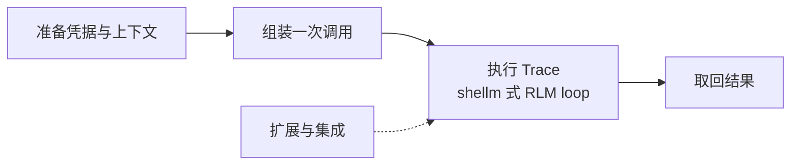

# llmcli 命令行工具 PRD

> 版本：v1.0（shellm 式 RLM agent loop 基线） | 日期：2026-10-03 | 状态：草稿 | 作者：（待填） | 评审人：yuekcc

摘要：为需要把 LLM 接入 shell 流水线的开发者/脚本作者，解决"缺少可控、可脚本化、可审计的本地 LLM 调用入口"的问题，达成"一条命令完成 输入 →（多轮 bash）推理 → 干净 stdout 输出"的目标。

## 背景与目标

**背景**：本仓库（mp-next）是用 C3 写的单二进制 CLI。依赖 `lib/curl.c3l`（libcurl 绑定）与 `lib/cjson.c3l`（JSON 解析），c3c 0.8.4 + LLVM 后端可用。若不使用本工具，与 LLM 交互只能手写 `curl` + `jq` 脚本，无法承载多轮推理，也不可复用。

**目标**：交付单二进制 CLI `llmcli`——OpenAI chat completions 兼容、内置 shellm 式 RLM agent loop（Trace/Turn 语义）、stdout/stderr 严格分离、`--session-id` 本地落盘续话。

**成功指标**：

| 指标 | 基线 | 目标值 | 时间窗 | 数据来源 |
|------|------|--------|--------|----------|
| 端到端可用性 | 无（仅手写 curl） | mock 回归场景全绿（108 项检查） | v1.0 发布前 | `scripts/regress.py` |
| stdout 纯净度 | — | 自动化断言 100% 通过（stdout 无任何日志行） | 同左 | `scripts/regress.py` |
| 代码块循环任务成功率 | 0（无循环） | mock"读文件→改文件"任务 N=20 次运行成功率 ≥ 90%（当前 20/20） | 同左 | `scripts/regress.py` |
| 首次成功调用耗时 | — | 新用户从读 `--help` 到跑通 < 5 分钟 | 同左 | 人工验收 |
| 可审计性 | — | 100% 生成代码在 stderr 可见 | 同左 | `scripts/regress.py` |
| 思维链可追溯 | 无（丢弃 `reasoning_content`） | 含 `reasoning_content` 的 mock 响应 100% 落盘，且 stdout 无泄漏、续话请求中已剥离 | 同左 | `scripts/regress.py` |

## 核心设计：shellm 式 RLM agent loop

一次运行即一条 **Trace**。循环如下：

1. 模型回复一段文本，期望其中含**一个** ```` ```bash ```` 代码块；
2. 运行时取出第一个代码块，交给本地 `bash -e -c` 执行；
3. 执行输出（stdout+stderr 合并）作为**下一条 `user` 消息**回填；
4. 重复，直到：

   - 代码里设置了 `FINAL="答案"` 或 `FINAL_FILE=路径` → 其值进 stdout，退出码 0；
   - 回复里**没有代码块** → 整段回复即最终答案，进 stdout，退出码 0。

**bash 是唯一的工具**：文件读写、构建、查询都由模型自己写 `cat` / `sed` / `grep` / `curl` / `python` 等命令完成。循环不使用 OpenAI `tools` 协议，请求体不带 `tools` 字段。

**关键约束**：

- 代码在 `set -e` 下执行；捕获 `FINAL` / `FINAL_FILE` 前先 `set +e`，否则未设 FINAL 的测试表达式会中断脚本；
- 只执行第一个代码块，多余代码块丢弃并在 stderr 告警；
- 执行输出超过 2000 行时截断为末 2000 行，完整输出落临时文件并给出路径；
- 空响应（无 content）视为循环未收敛，退出码 3。

### 消息角色

RLM 循环只有两类角色：

| 角色 | 内容 |
|------|------|
| `system` | 系统提示词（每次运行重新注入，不入库） |
| `user` | 用户输入，或代码块的执行输出 |
| `assistant` | 模型的回复（散文 + 代码块）与思维链 |

## 范围与约束

**包含**：

- CLI 单二进制；prompt / stdin / `--input-file` 三选一输入；
- OpenAI chat completions 兼容端点；非流式（`stream:false`）；
- shellm 式 RLM agent loop（Trace/Turn）；bash 唯一工具；
- `--session-id` 本地落盘续话（含 `reasoning_content` 全量落盘）；
- 退出码约定（0/1/2/3/130）；stderr 过程日志（无 logger 模块）；
- `--max-turns` turn 上限；`--quiet/--debug/--no-color`；`--list-sessions`；`--config-dir`。

**不包含**：

- 库/SDK 形态；GUI/TUI；多 provider 协议（Anthropic 等）；SSE 流式输出；
- shellm 生态的其它自定义工具与机制（`traj` / `context` / `llm` / `mem` / `skills`、Docker 沙箱、嵌套 sub-run、activity beacon 看门狗）；
- 限制类机制的其余开关（`--timeout`、连续失败阈值）与强制逻辑；
- 完整 logger 框架；密钥托管/加密；工具市场或远程工具。

**假设与已定决策**：

1. **完成信号用 `FINAL` / `FINAL_FILE`**；无代码块的回复直接作最终答案（单轮问答即走这条路）。
2. **bash 即唯一工具**，不再有内置工具注册表。
3. 输入互斥：`<prompt>` / stdin / `--input-file` 严格三选一。
4. `--api-key` 必填：不提供环境变量兜底；缺失即用法错误（退出码 2），不发网络请求；密钥在 stderr 一律脱敏。
5. `--model` 必填；`--api-url` 默认 `https://api.openai.com/v1/chat/completions`。
6. 退出码（细分）：0 成功；1 网络/API/协议错误；2 用法/参数错误；3 循环未收敛；130 被使用者中断。
7. **限制类机制默认不加**：默认不设 turn 上限、不设 HTTP/命令超时；失控保护依赖使用者 Ctrl+C 与外部超时工具（CI）。turn 上限已作为 `--max-turns` 落地（不传或 <=0 即不设上限）。
8. 会话落盘：路径 `~/.llmcli/sessions/<id>.jsonl`（Windows 为 `%USERPROFILE%\.llmcli\sessions`），可用 `--config-dir` 覆盖根目录（默认 `~/.llmcli`；不读任何环境变量）；一行一条 JSON（含 `ts`/`turn`/`message`）；**全量记录** user/assistant 两类消息，执行输出原样入库；**不提供清理功能**，docs 说明文件位置与手动删除方式。
9. 落盘时机：**每个 turn 完整结束后立刻追加**（整轮一次 write）；`turn` 是每次运行内的请求轮号（续话从 1 重计），`ts` 是消息发生的时刻（本地时区 RFC3339，秒级）。
10. `reasoning_content` 处理：assistant 消息的 `reasoning_content` **全量落盘**；组装后续请求时**剥离该字段**；stderr 默认只打印长度摘要、`--debug` 打印全文；stdout 永不出现。
11. 平台范围：v1 仅在 Windows/x64 上验证；实现不得依赖平台专有 API，兼顾 Linux。代码统一经 `bash -e -c` 执行（Windows 上要求 Git for Windows）。
12. `--help` 输出到 stdout、退出码 0；参数错误时用法提示到 stderr、退出码 2。

**依赖**：c3c ≥ 0.8.4；`lib/curl.c3l`、`lib/cjson.c3l`（windows-x64 为预编译库，linux/macos 走系统 curl / C 源码）；回归验证依赖 `scripts/mock_llm.py`（本地 mock OpenAI 服务）。

**风险**：

| 风险 | 影响 | 缓解 |
|------|------|------|
| 生成代码默认放行（已确认接受） | 提示注入/模型误判可致任意命令执行 | 每轮代码原文打印到 stderr 可审计；`--help`/docs 显式警示 |
| 模型不按围栏格式回复 | 没有代码块时被当最终答案，可能截断任务 | 提示词给出正/反例；`extract_code` 容忍标记围栏缀于行末；无代码块文本作答案与 shellm 一致 |
| `set -e` 下捕获 FINAL 被中断 | FINAL 写不出去、循环不收敛 | 包装脚本在捕获前 `set +e` |
| 默认不设限制（`--max-turns` 可止损） | LLM 打转会持续烧 token；HTTP/命令可永久挂起；大输出可能撑爆上下文 | 可用 `--max-turns` 在 n 次请求后止损（stderr 说明、stdout 空、退出码 3）；输出超 2000 行截断；CI 用外部超时包裹 |
| libcurl 绑定能力/平台差异 | 请求失败或 Linux 兼容问题 | v1 仅在 Windows/x64 验证，代码不依赖平台专有 API，为 Linux 留出余地 |
| 会话文件并发写 | 历史损坏 | 追加原子写 + 检测；损坏行跳过并警告 |
| 会话/日志含对话内容、思维链与完整执行输出，可能含敏感数据 | 隐私泄露 | 文件禁止存 key；docs 说明文件位置与手动删除方式；`--quiet` 不改变落盘，需文档明示 |

**非功能**：

- 性能：瓶颈是网络与 LLM 延迟；CLI 启动与解析开销应无感。
- 安全：密钥不落盘、日志脱敏；生成代码的风险已接受并记录。
- 可观测性：v1 为 stderr 人类可读打印，日志入口集中在 `src/log.c3`，为后续 logger 模块预留替换点；`reasoning_content` 默认以长度摘要出现在 stderr，`--debug` 可看全文。
- 成本：stderr 打印每轮 token 用量（API 返回 `usage` 时）。
- 可移植：v1 验证范围仅 Windows/x64；实现避开平台专有 API，Linux 作为兼容目标而非验证目标。

## 故事地图

**核心流程**：


```mermaid
flowchart LR
  A1[准备凭据与上下文] --> A2[组装一次调用] --> A3[执行 Trace<br>shellm 式 RLM loop] --> A4[取回结果]
  A5[扩展与集成] -.-> A3
```

**活动描述**：

- **A1 准备凭据与上下文**
  - **T1.1 提供 API 凭据**
    - As a 脚本作者, I want 用 `--api-key` 提供密钥, so that 每次调用显式声明凭据，来源清晰可控
      - AC: Given 未传 `--api-key`, When 运行, Then 退出码 2、stderr 提示缺失、不发任何网络请求，且不读取任何环境变量
      - AC: Given 提供 `--api-key`, When 运行, Then 请求携带该密钥，且 stderr 只显示脱敏形式（如 `sk-***abc`）
  - **T1.2 指定端点与模型**
    - As a 使用者, I want `--api-url` 与 `--model` 可配置（`--api-url` 有默认值）, so that 官方与兼容端点都能用
      - AC: Given 未传 `--api-url`, When 运行, Then 请求发往默认 `/v1/chat/completions`
      - AC: Given 未传 `--model`, When 运行, Then 退出码 2 并提示 `--model` 必填
  - **T1.3 注入 system prompt**
    - As a 使用者, I want `--system-prompt` 与 `--system-prompt-file` 两种方式, so that 短提示词随手写、长提示词放文件
      - AC: Given 二者同时给出, When 运行, Then 退出码 2（互斥）
      - AC: Given `--system-prompt-file` 指向不存在的文件, When 运行, Then 退出码 2 且 stderr 指明路径
      - AC: Given 只给其一, When 请求发出, Then `messages[0]` 为 `role=system`；都不给时用内置默认提示词（`src/system_prompt.md`）
      - AC: Given 提示词含 `{{date}}` / `{{cwd}}` / `{{os}}`, When 运行, Then 占位符被展开，且多字节内容不被破坏
  - **T1.4 会话标识**
    - As a 使用者, I want `--session-id` 标识一个会话, so that 同一会话可跨调用累积
      - AC: Given 传入 `--session-id`, When 运行, Then stderr 的 Trace 行包含该 id
      - AC: Given 非法 id（含 `..`、路径分隔符等）, When 运行, Then 退出码 2，不读任何输入

- **A2 组装一次调用**
  - **T2.1 位置参数 prompt**
    - As a 脚本作者, I want 用位置参数直接传 prompt, so that 一行命令即可发起问答
      - AC: Given prompt 含空格/引号/中文, When 运行, Then 原样传递，不截断、不转义破坏
  - **T2.2 stdin 管道输入**
    - As a 脚本作者, I want 从 stdin 读输入, so that `cat x.md | llmcli ...` 可用
      - AC: Given 存在管道输入且未给位置参数/`--input-file`, When 运行, Then user message 为管道输入全文
      - AC: Given stdin 为终端（无管道）且无其它输入, When 运行, Then 退出码 2 提示需要输入，不阻塞等待
  - **T2.3 `--input-file`**
    - As a 使用者, I want `--input-file` 指定输入文件, so that 长素材不必走管道
      - AC: Given 文件存在, When 运行, Then user message 为该文件全文（UTF-8）
      - AC: Given 文件不存在/不可读, When 运行, Then 退出码 2 且 stderr 指明路径
  - **T2.4 输入来源互斥校验**
    - As a 使用者, I want prompt / stdin / `--input-file` 严格三选一, so that 不会因隐式合并产生意外请求
      - AC: Given 任意 ≥2 个来源同时出现, When 运行, Then 退出码 2，stderr 列出冲突来源，不发起网络请求
  - **T2.5 `--help` 与用法提示**
    - As a 新用户, I want `--help` 列出全部 flags 与典型示例, so that 不用读源码
      - AC: Given 运行 `--help`, When 输出, Then 用法、flags、退出码表与示例出现在 stdout，退出码 0
      - AC: Given 参数错误, When 输出, Then 用法简报到 stderr，退出码 2

- **A3 执行 Trace（shellm 式 RLM loop）**
  - **T3.1 发起非流式 chat completion**
    - As a 使用者, I want 一次调用即一个 Trace, so that 排查与计费可控
      - AC: Given 合法输入, When 运行, Then 向 `--api-url` POST JSON：`model`、`messages`、`stream=false`，**不带 `tools`**
      - AC: Given 网络错误或非 2xx 响应, When 失败, Then stderr 打印状态码与响应摘要（截断），退出码 1，stdout 为空
  - **T3.2 解析响应**
    - As a 使用者, I want 正确识别 `content` / `finish_reason` / `reasoning_content` / `usage`, so that 循环能按协议推进
      - AC: Given 响应非法 JSON 或缺关键字段, When 运行, Then 退出码 1，stderr 打印原始响应（截断）
      - AC: Given assistant 消息含 `reasoning_content`, When 解析, Then 该字段被捕获并纳入落盘路径，且绝不出现在 stdout
  - **T3.3 代码块提取**
    - As a 使用者, I want 模型写的 ```bash 代码块被准确取出, so that 只执行它想执行的那段
      - AC: Given 回复含一个 ```bash 块, Then 取块内内容
      - AC: Given 回复含多个代码块, Then 只取第一个并告警
      - AC: Given 回复无围栏, Then 判定无代码块（整段回复作最终答案）
      - AC: Given 标记围栏缀在散文行末（如"……这样。```bash"）, Then 仍能开块
  - **T3.4 执行与回填**
    - As a 使用者, I want 代码被执行且输出回填, so that 模型能看到结果继续推理
      - AC: Given 代码块, When 执行, Then stdout/stderr 合并后作为下一条 `role=user` 消息
      - AC: Given 执行退出码非 0, When 回填, Then 输出尾部带 `[exit N]`
      - AC: Given 输出超过 2000 行, Then 截断为末 2000 行，完整输出落临时文件并给出路径
      - AC: Given 命令长时间不退出, When 使用者 Ctrl+C, Then 子进程被终止无残留，stdout 为空，退出码 130
  - **T3.5 完成信号**
    - As a 使用者, I want FINAL / FINAL_FILE 能收尾, so that 最终答案干净进 stdout
      - AC: Given 代码设 `FINAL="x"`, Then stdout 为 `x`，退出码 0
      - AC: Given 代码设 `FINAL_FILE=f`, Then stdout 为 `f` 的内容
      - AC: Given 回复无代码块, Then 整段回复进 stdout，退出码 0
      - AC: Given 空响应, Then stdout 空、退出码 3
  - **T3.6 失控保护（`--max-turns`）**
    - As a 使用者, I want 能限制 turn 数, so that 失控时能自动止损
      - AC: Given 不传 `--max-turns` 或传 <=0, When 模型持续返回代码块, Then 循环持续直到 API 错误或使用者中断
      - AC: Given `--max-turns n`（n>0）, When 即将发起第 n+1 次请求, Then 终止循环、stderr 说明原因、stdout 为空、退出码 3
      - AC: Given `--max-turns` 收到非整数, When 运行, Then 退出码 2 且 stderr 指明该参数

- **A4 取回结果**
  - **T4.1 stdout 纯净输出**
    - As a 脚本作者, I want stdout 只包含最终答案, so that 结果可直接 `| jq` 或重定向
      - AC: Given 多轮运行, When 成功, Then stdout 仅最终答案，无任何日志行
      - AC: Given 运行失败, When 终止, Then stdout 为空
  - **T4.2 stderr 过程日志**
    - As a 使用者, I want 过程信息走 stderr, so that 管道数据不被污染
      - AC: Given 默认运行, When 结束, Then stderr 含 Trace 起止、每轮 turn 摘要、token 用量（若 API 返回）、错误详情
      - AC: Given `--quiet`, When 运行, Then stderr 只保留错误；Given `--debug`, Then 额外打印原始请求/响应（密钥脱敏）
      - AC: Given 响应含 `reasoning_content`, When 默认运行, Then stderr 只打印长度摘要；Given `--debug`, Then 打印全文；任何情况下均不写入 stdout
  - **T4.3 退出码**
    - As a 脚本作者, I want 稳定的退出码, so that 脚本可分支处理
      - AC: 成功 0；用法/参数错误 2；网络/API/协议错误 1；循环未收敛 3；中断 130；退出码表写入 `--help`

- **A5 扩展与集成**
  - **T5.1 会话落盘续话**
    - As a 使用者, I want 同一 `--session-id` 跨调用累积历史, so that 多轮对话与长期任务可续
      - AC: Given 首次运行, When 每个 turn 完整结束, Then 追加该 turn 的消息（user/assistant）；Trace 失败/中断时已完成的 turn 已在文件里
      - AC: Given 再次运行, When 请求发出, Then messages = 历史 + 新输入
      - AC: Given 历史消息含 `reasoning_content`, When 组装请求, Then 该字段被剥离
      - AC: Given 会话文件损坏或含非法 JSON 行, When 加载, Then 跳过该行并警告，不中断本次运行
      - AC: Given 每条记录, Then 带自己的 `turn`（与 stderr 的 `[turn N]` 一致）与 `ts`（消息发生时刻）
  - **T5.2 存储位置可配置**
    - As a 使用者, I want 会话目录可改, so that 能放到项目内或受控目录
      - AC: Given 传 `--config-dir`, When 运行, Then 会话目录随之改变；未传时用默认 `~/.llmcli`（存放位置不读环境变量）
  - **T5.3 会话查看（清理手动）**
    - As a 使用者, I want 查看已有会话, so that 能定位文件并自行管理
      - AC: Given `--list-sessions`, When 运行, Then 列出 id、更新时间、消息数到 stdout
      - AC: Given 需要删除, Then 由使用者手动删除会话文件（v1 不提供清理功能）
  - **T5.4 脚本/CI 集成**
    - As a CI 维护者, I want 非交互、输出可控, so that llmcli 能安全进流水线
      - AC: Given 全流程, When 运行, Then 不需要任何交互输入
      - AC: Given 输出非终端, When 运行, Then 不输出 ANSI 颜色（或 `--no-color` 关闭）
      - AC: Given v1 无内置超时, Then docs 说明在 CI 中用外部超时包裹调用

**可追溯**：目标（成功指标）← 活动（A1–A5）← 故事（T 编号）← AC；其中"stdout 纯净度"由 T4.1 覆盖，"可审计性"由 T3.4 覆盖，"代码块循环成功率"由 T3.3–T3.5 覆盖，"思维链可追溯"由 T3.2/T4.2/T5.1 覆盖。

## 模块结构

每个模块内部统一按「import 分组 → 常量 → 类型 → 公开接口 → `@private` 辅助」排列，用 `// ---- x ----` 分节。

| 文件 | 职责 |
|------|------|
| `cmd/llmcli.c3` | `main`：解析 → 初始化日志/信号 → 分发 help / list-sessions / run |
| `src/cli.c3` | `Ctx`（一次运行的全部配置）、`parse`/`resolve`（纯解析 + I/O 补齐）、`HELP` |
| `src/agent.c3` | Trace 主循环：请求 → 提取/执行代码块 → 回填 → 落盘 → 退出码 |
| `src/client.c3` | 一次 API 往返：组装请求 → POST → 解析响应（`chat_once`） |
| `src/chat.c3` | 消息结构、请求/存档序列化、响应解析 |
| `src/rlm.c3` | `extract_code`：从回复里取第一个 ```bash 代码块 |
| `src/runtime.c3` | `run_bash`：执行代码块、捕获 FINAL/FINAL_FILE、中断处理 |
| `src/http.c3` | libcurl 绑定封装：`http_post_json` |
| `src/session.c3` | 会话落盘（逐 turn 追加）与读回 |
| `src/log.c3` | stderr 分级日志与密钥脱敏 |
| `src/buf.c3` | 共享小工具：C 串转换、UTF-8 安全截断 |
| `src/system_prompt.md` | 内置默认系统提示词（`$embed` 编译期嵌入） |

分层：`cmd` → `agent`（循环）→ `client`（往返）→ `chat`/`http`；侧翼模块 `rlm`（提取）、`runtime`（执行）、`session`（落盘）、`log`/`buf`（共享）。

`cli::Ctx` 是一次运行（一个 Trace）的配置载体，经函数参数向下传递，不是全局；字段按「初始设置 / 本次运行边界 / 解析中间量 / 日志开关 / 动作开关」五节分节，新增字段必须先归入某一类。

## 迭代规划

- **已交付：v1 基线**
  - 目标：单轮问答、shellm 式 RLM 多轮循环、会话续话、CI 可集成
  - 覆盖活动/故事：A1–A5 全部（T1.1–T5.4）
  - 退出标准：`c3c test` 52/52 全绿；`python scripts/regress.py` 108/108 全绿

- **后续（非 v1）**
  - SSE 流式输出（`stream:true` + stdout 增量）；`--timeout` 与连续失败阈值；更多限制类开关；代理与自定义 header；logger 模块。

## 开放问题

| 问题 | 影响 | 状态 |
|------|------|------|
| 是否引入 shellm 生态的 `traj` / `context` / sub-run | 决定循环是否需要 fork/DAG 与嵌套运行 | 待定 |
| `--timeout`、连续失败阈值等限制类开关的优先级 | 失控保护强度 | 待排期 |
| server 端 `FINISH_REASON` 语义（如 `length`）是否要单独处置 | 长回答被截断时的收尾行为 | 待定 |
| sandbox（Docker 等）是否要做 | 生成代码的隔离强度 | 待定 |
