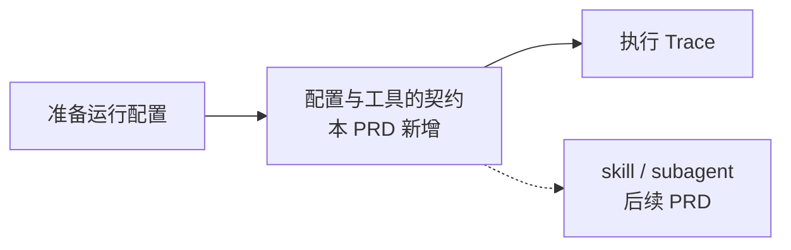

# llmcli 运行配置上下文与工具接口重构 PRD

> 版本：v0.1（`Options` → `Ctx` + `ToolFn` 携带上下文） | 日期：2026-09-29 | 状态：草稿（待评审） | 作者：（待填） | 评审人：yuekcc

摘要：为后续的 skill 系统与 subagent 能力，解决"运行配置没有稳定载体、工具接口无法感知本次运行"的问题，达成"一次运行 = 一个 `Ctx` 对象，工具经统一签名拿到它"的目标。

## 背景

001 PRD 交付的 `cli::Options` 是 **argv 的传输结构**：`cli::resolve()` 把命令行解析、文件读取、stdin 读取、占位符展开全都做进这一个 struct，然后 `agent::run(&opts)` 独占消费它。

这个设计在**只有一个消费者**时是成立的，现状也确实如此（`grep` 全部源码：`agent::run` 是唯一消费者）。但它有两个已经开始渗漏的问题：

| # | 现象 | 证据 |
|---|------|------|
| 1 | `Options` 是全部字段的**合法构造形态**——`cli_test.c3` 手工构造 `cli::Options options; options.model = "m";`（`chat_test.c3:136,163`），没有任何东西区分"初始设置"与"本次运行的状态" | 字段契约只存在于注释里 |
| 2 | 工具接口**拿不到任何运行配置**：`alias ToolFn = fn ToolResult(CJsonItem* args)`（`tools.c3:25`） | 工具要拿配置只能去够全局 |

第 2 条已经产生了一个真实的全局：`bash.c3:10` 的 `Process* active_child`，注释写明"不能是 tlocal：Windows 上信号处理器跑在另一个线程"，是为中断处理器服务的模块级可变状态。

**问题**（一句话）：001 的 `Options` 把"运行配置"和"本次运行状态"混在一个没有契约的 struct 里，而工具接口连这个 struct 都拿不到——后续任何"同一进程内换一份配置再跑一次"的需求（subagent 的受限工具集、skill 的提示词注入）都会被逼回全局变量。

## 目标

| 指标 | 基线 | 目标值 | 时间窗 | 数据来源 |
|------|------|--------|--------|----------|
| 配置载体 | `cli::Options`（argv 传输结构，无契约注释） | `cli::Ctx`（字段按三类分节并写明契约） | 本次重构 | `c3c test` |
| 工具可见上下文 | 0（`ToolFn` 无配置参数） | 5/5 内置工具经 `ToolFn` 首参拿到 `Ctx` | 同左 | 同上 |
| 配置解析的可测性 | `cli::resolve` 带 I/O 副作用（读文件 + 阻塞读 stdin） | 纯解析路径 `cli::parse` 不产生任何 I/O，可单测 | 同左 | 同上 |
| 行为回归 | 54 tests / 120 regress checks 全绿 | 全绿（本 PRD 是**纯重构**，不改任何对外行为） | 同左 | `c3c test` + `scripts/regress.py` |

**本次不设新功能指标**：这是**不改变任何对外行为**的重构，成功的定义是"基线全绿 + 接口就位"。

## 范围与约束

**包含**：

- `cli::Options` 更名为 `cli::Ctx`，字段按「初始设置 / 本次运行边界 / 日志开关 / 动作开关」分节并写明各自契约；
- `agent::run(&ctx)`；`build_request` / `chat_once` 首参跟进；
- `alias ToolFn = fn ToolResult(Ctx* ctx, CJsonItem* args)`，5 个内置工具（bash / edit_file / read_file / write_file / list_dir）与 `tools::run_tool` 跟进；
- `cli::resolve` 拆出**不产生 I/O 的纯解析**路径；
- 测试与 `docs/` 同步。

**不包含**（明确划出，避免范围蔓延）：

- **subagent 的完整实现**（独立进程、追踪线程、取消语义）——**本次不做**，仅保证 `ToolFn` 签名能承载它；
- **skill 系统的格式与加载**（文件格式、发现方式、注入策略）——本次只留"工具集可按 Trace 过滤"的接口口子，不定义 skill 长什么样；
- **全局 context / 单例**：本次明确**不引入**（理由见假设 2）；
- 并发跑多个 Trace、`active_child` 的线程安全化——001 与本次均为"一进程一 Trace"，Ctrl+C 杀全部（含子进程）；
- `--timeout` / 输出截断 / 失败阈值（仍属 001 的 S5）；
- 任何对外行为变更：flag、退出码、落盘格式、stdout/stderr 契约**一律不动**。

**假设与已定决策**（2026-09-29 评审确认）：

1. **`Ctx` 是按运行传递的，不是全局。** 一次运行（一个 Trace）一个 `Ctx`，经函数参数向下传递。
2. **不引入全局 context。** 已确认 subagent 走**独立进程**实现、Ctrl+C 为**杀全部**。独立进程意味着子 agent 的配置就是子进程的 argv，父进程的 `Ctx` 无需被它够到——全局对象因此没有服务对象，属于假想的缝，本次不建。
3. **`active_child` 维持现状**（`bash.c3:10` 的模块级全局）。在"一进程一 Trace + Ctrl+C 杀全部"下它不需要改造；**本次不动它**，等真出现并发多 Trace 再议（见开放问题）。
4. **`Ctx` 只装配置，不装运行期状态。** `turn`、`messages`、`pending`、`session::Session store` 继续留在 `agent::run` 的局部变量里——它们的作用域就是那个函数。
5. **`Ctx` 只装"属于本次运行"的配置**，不装工具注册表、不装 logger 实例。`tools::` 与 `log::` 维持模块级接口（`log::init` / `log::add_secret` 已在收口开关），本次不为其增加 hub 层。
6. 本次是**纯重构**：不改任何 flag、退出码、落盘格式与 stdout/stderr 契约。

**依赖**：无新增。仅用现有 `c3c 0.8.4` 能力；`fn` 指针作为 struct 字段以模块函数/实例方法两种形态赋值均已在 0.8.4 上验证可用（compile + link + run 探针）。

**风险**：

| 风险 | 影响 | 缓解 |
|------|------|------|
| `ToolFn` 加参数是**破坏性签名变更** | 5 个内置工具 + `run_tool` + `test/tools_test.c3` 需同步；漏改即编译失败 | 编译期全量暴露，不会静默；`docs/tools.md` 的接口说明同步 |
| 更名 `Options` → `Ctx` 触及 12 个文件、`cli_test.c3` 约 20 处构造点 | 机械改动量大，易漏 | 纯改名，编译器兜底；不趁机改语义 |
| 拆 `resolve` 可能**改变既有 I/O 时序** | `--help` / `--list-sessions` 当前在读 stdin **之前**返回（`cli.c3:238`）；若纯解析路径漏掉这个短路，会退回"阻塞等 stdin" | 列入 T7.3 的 AC 显式断言 |
| 边界扩张 | 有人顺手把 skill / subagent 塞进来 | 「不包含」已显式划出；subagent 另立 PRD |

**非功能**：

- **可测试性**：`cli::parse` 无 I/O 副作用，可直接单测；`Ctx` 可在测试里整体构造（不依赖 argv）。
- **契约内聚**：`Ctx` 字段按三类分节注释，新增字段必须先归入某一类——避免它退化回"什么都往里塞"的篮子。
- **兼容性**：对外行为零变更，001/002 的全部 AC 继续成立。
- **内存**：不改归属规则。`system_prompt` / `user_input` 仍是 `mem` 堆串、调用方负责释放。

## 故事地图

**关键流程**：

**活动描述**：

- **A7 配置与工具的契约**（本 PRD 新增活动；为 A3 与服务后续能力提供稳定接口）

  - **T7.1 运行配置有稳定载体**
    - As a 后续开发者, I want 一次运行的配置是一个有名字、有契约的对象, so that 我不必猜哪些字段是同一种东西
      - AC: Given 源码, When 阅读 `cli::Ctx`, Then 字段按「初始设置 / 本次运行边界 / 日志开关 / 动作开关」分节，每节注明契约（是否可换、换了有什么后果）
      - AC: Given 一次运行, When `agent::run` 执行, Then 它只接受 `Ctx*`，不再出现 `cli::Options`
      - AC: Given 全仓库, When `grep cli::Options`, Then 零命中（更名彻底，无遗留别名）
      - AC: Given `turn`/`messages`/`pending`/`store`, When 阅读 `agent::run`, Then 它们仍是局部变量，不在 `Ctx` 里
      - 优先级/切片：Must / S7 ｜ 依赖：无

  - **T7.2 工具能感知本次运行**
    - As a 后续开发者, I want 工具执行时能拿到本次运行的配置, so that 诸如 subagent 这类工具不必再去够全局
      - AC: Given `tools.c3`, When 阅读 `ToolFn`, Then 签名为 `fn ToolResult(Ctx* ctx, CJsonItem* args)`
      - AC: Given 5 个内置工具, When 编译, Then 全部匹配新签名，且 `tools::run_tool` 透传 `ctx`
      - AC: Given `bash` 执行一条命令, When 执行完成, Then 行为与重构前逐字节一致（stdout 内容、退出码、截断行为）
      - AC: Given `docs/tools.md` 的示例, When 照做新增一个工具, Then 示例签名与新 `ToolFn` 一致、可编译
      - 优先级/切片：Must / S7 ｜ 依赖：T7.1

  - **T7.3 配置解析可单独测试**
    - As a 写测试的人, I want 一个不产生 I/O 的解析路径, so that 我能直接测参数解析而不必喂 stdin 或准备文件
      - AC: Given `cli::parse(args)`, When 传入非法 flag, Then 返回错误且**不读 stdin、不读任何文件**
      - AC: Given `cli::parse({"llmcli", "--help"})`, When 调用, Then 立即返回且不阻塞（stdin 是终端时也不例外）
      - AC: Given `cli::parse({"llmcli", "--list-sessions"})`, When 调用, Then 返回成功且 error 为空（不要求 `--model`/`--api-key`，与 001 现有 AC 一致）
      - AC: Given 完整的 `resolve`, When 传入合法参数, Then 最终 `Ctx` 与重构前的 `Options` 逐字段相等
      - 优先级/切片：Should / S7 ｜ 依赖：T7.1

  - **T7.4 行为零回归**
    - As a 使用者, I want 重构不改变任何对外行为, so that 我现有的脚本与 CI 不受影响
      - AC: Given 重构后, When `c3c test`, Then 全绿（基线 54 passed；本次新增 T7.3 用例后为 64 passed）
      - AC: Given 重构后, When `python scripts/regress.py`, Then 全绿（基线 120 项检查）
      - AC: Given 任一 flag，When 运行, Then 语义、退出码与 stderr 输出格式与重构前一致
      - AC: Given 一个既有会话文件, When 续话, Then 落盘格式不变、旧文件仍可 `load`
      - 优先级/切片：Must / S7 ｜ 依赖：T7.1、T7.2

## 迭代规划

- **S7 配置上下文与工具接口重构（本次交付）**
  - 目标：把运行配置收敛为有契约的 `Ctx`，并让工具接口能拿到它；对外行为零变更
  - 覆盖活动/故事：A7（T7.1–T7.4）；服务 A3 的既有实现
  - 退出标准：`c3c test` 64/64 全绿（基线 54 + 本次新增 10）；`python scripts/regress.py` 120/120 全绿；`grep cli::Options` 零命中；`ToolFn` 新签名全量落地；`docs/tools.md` 示例同步
  - 依赖/风险：`ToolFn` 为破坏性变更（编译期兜底）；`resolve` 拆分需保住 `--help`/`--list-sessions` 的短路语义（见风险表）

## 与 001 的关系

本 PRD **不修订** 001 的任何已确认决策，只重构其实现载体：

- 001 假设 4（`--api-url` 默认值）、假设 7（会话落盘）、假设 8（`reasoning_content`）等**全部保持不变**；
- 001 的 T3.4「工具接口与注册表（稳定扩展点）」的 AC「新增工具时 agent loop 零改动」**继续成立**——`ToolFn` 加参数是接口升级，注册表与 loop 结构不变；
- 001 的 S5 清单（`--timeout`、截断、失败阈值、logger 模块、SSE）不受影响；
- 001 未决项与 002 的全部约定不受影响。

## 可追溯

成功指标 → 活动（A7）→ 故事（T7.1–T7.4）→ AC；本 PRD 是后续 skill / subagent PRD 的前置依赖。

## 开放问题

| 问题 | 影响 | 状态 |
|------|------|------|
| `active_child` 是否要随并发 Trace 改造 | 当前"一进程一 Trace"下无需改造；若将来同进程并发跑 Trace，`bash.c3:107` 的写与中断处理器读存在竞态 | 待定（本次明确不动，见假设 3） |
| skill 的形态（文件格式 / 发现方式 / 注入策略） | 决定 `Ctx` 是否需要 `skills` 字段与工具过滤的具体数据结构 | 留给下一份 PRD |
| 工具集按 Trace 过滤（enabled 名单）的数据结构 | subagent 的受限工具集与 skill 的按需工具都需要它；本次只留签名口子不定义结构 | 待定（与 skill PRD 一并） |
| `Ctx` 是否需要「只读」约束的编译期表达 | 目前靠注释约定（假设 1/4/5），C3 无 const 成员约束 | 待定 |
