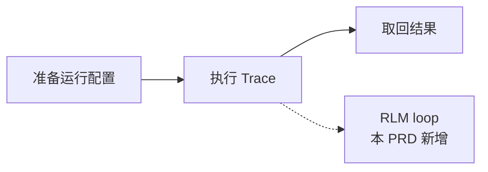

# llmcli Agent Loop 重构为 shellm 式 RLM PRD

> 版本：v0.1（tool_calls → bash 代码块循环） | 日期：2026-10-03 | 状态：草稿（待评审） | 作者：（待填） | 评审人：yuekcc

摘要：为对齐 headlong `shellm` 的设计，解决"loop 依赖 OpenAI 工具协议、能力被五个内置工具框住"的问题，达成"模型写 bash 代码、运行时执行、输出回填，直到代码设置 `FINAL` / `FINAL_FILE`"的目标——bash 成为唯一的工具。

## 背景

001 交付的 agent loop 走 OpenAI 原生 `tool_calls`：注册表里五个内置工具（Bash / EditFile / ReadFile / WriteFile / ListDir），`finish_reason=tool_calls` 时执行工具、以 `role=tool` 回填，`stop` 时结束。

headlong 的核心 `shellm` 是另一种形态的 RLM（Recursive Language Model）：模型回复**一个 ```bash 代码块**，运行时把它当脚本执行，stdout/stderr 作为**下一条 user 消息**回填，循环往复；模型在代码里设置 `FINAL="答案"` 或 `FINAL_FILE=路径` 来宣告完成。没有工具注册表，bash 就是唯一的工具——`cat` / `sed` / `grep` / `curl` / `python` 由模型自己组合。

**问题**（一句话）：tool_calls 形态把"能做什么"钉死在注册表上，且依赖端点的 tools 协议；shellm 形态把能力交还给 shell，循环本身更小。

## 目标

| 指标 | 基线 | 目标值 | 时间窗 | 数据来源 |
|------|------|--------|--------|----------|
| loop 形态 | 原生 `tool_calls` + 五工具注册表 | shellm 式：```bash 代码块 → 执行 → user 回填 | 本次重构 | `c3c test` + `scripts/regress.py` |
| 内置工具 | 5 个（Bash/EditFile/ReadFile/WriteFile/ListDir） | 0 个（bash 即唯一工具） | 同左 | 同上 |
| 完成信号 | `finish_reason=stop` 且 content 非空 | 代码里设 `FINAL` / `FINAL_FILE`；无代码块的回复直接作答案 | 同左 | 同上 |
| 请求体 | 带 `tools` 字段 | 不带 `tools`；messages 里只有 system/user/assistant | 同左 | 回归断言 |

## 范围与约束

**包含**：

- 新增 `src/rlm.c3`：从模型回复里取第一个 ```bash / ```sh / ``` 代码块（含后缀行末围栏、多块只取第一并告警）；
- 新增 `src/runtime.c3`：执行代码块（`bash -e -c`）、合并 stdout/stderr、捕获 `FINAL` / `FINAL_FILE`，并承接 `active_child` 中断处理；
- `src/agent.c3`：循环改为 shellm 式；执行输出以 `role=user` 回填；落盘仍逐 turn 且格式不变；
- `src/chat.c3`：去掉 `ToolCall` 解析与序列化，保留 content / reasoning / finish_reason / usage；
- `src/system_prompt.md`：改为"写 ```bash 代码块、用 FINAL/FINAL_FILE 报捷"的 RLM 提示词；
- 删除 `src/tools/`、`src/tool_schemas/`、`docs/tools.md`、`src/system_prompt.en.md`；
- 回归脚本与 mock 改为按"每轮回复文本"回放。

**不包含**：

- shellm 的其它自定义工具与生态（`traj` / `context` / `llm` / `mem` / `skills` / Docker 沙箱 / 嵌套 sub-run）——本次**只做 agent loop**；
- 交互式命令的 activity beacon 看门狗、输出字节数上限、`set -x` 重放、工具标记（`<tool_call>`）归一化；
- SSE 流式、多 provider 协议、`--timeout` / 失败阈值（仍属 001 的 S5）。

**假设与已定决策**：

1. **bash 是唯一工具。** 文件读写改由模型用 `cat` / `sed` 等命令完成，不再有 EditFile/ReadFile/WriteFile/ListDir。
2. **完成信号用 `FINAL` / `FINAL_FILE`。** 代码在 `set -e` 下执行；捕获前 `set +e`，否则未设 FINAL 的测试表达式会中断脚本。
3. **无代码块的回复即最终答案。** 这保证单轮问答（simple）与"模型直接作答"都能收尾；空响应才判未收敛（退出码 3）。
4. **执行输出以 `role=user` 回填。** 会话文件因此只有 user/assistant 两类角色；丢弃了 001 的 `role=tool` 与 `tool_call_id`。
5. **保留全部对外 flags 与退出码**：`--session-id` 落盘续话、`--max-turns`、`--system-prompt(-file)`、`--quiet/--debug/--no-color`、退出码 0/1/2/3/130 一律不变。

**修订 001 的条目**：

- 001 假设 1（`finish_reason=tool_calls` 继续循环）→ 改为"有 ```bash 代码块则执行并继续；设 FINAL 或回复无代码块则结束"。
- 001 假设 7 的"全量记录 user/assistant/tool 三类消息"→ 改为"user/assistant 两类"（执行输出是 user）。
- 001 T3.4/T3.5/T3.6/T3.8（工具接口、Bash/EditFile 工具、工具错误回填）→ 由本 PRD 的统一 bash 代码块循环取代。
- 003 的 `ToolFn` / 工具注册表相关设计**作废**（工具注册表已删除）；`cli::Ctx` 运行配置载体保留。

## 风险

| 风险 | 影响 | 缓解 |
|------|------|------|
| 模型不按围栏格式回复 | 没有代码块时会被当最终答案（可能截断任务） | 提示词给出正/反例；`extract_code` 容忍后缀行末围栏；无代码块文本作答案与 shellm 一致 |
| `set -e` 下捕获 FINAL 被中断 | FINAL 写不出去、循环不收敛 | 包装脚本在捕获前 `set +e`（与 shellm 一致） |
| 执行任意 bash | 提示注入/误判导致任意代码执行 | 每轮代码原文打印到 stderr 审计；`--help`/docs 显式警示；与旧 Bash 工具同级风险 |
| 大输出撑爆上下文 | API 报错 | 输出超过 2000 行时截断为末 2000 行，完整输出落临时文件并给出路径 |

## 故事地图

**关键流程**：



- **A8 shellm 式 RLM loop**（本 PRD 新增活动；取代 001 的 A3 工具循环实现）
  - **T8.1 回复取代码块**
    - As a 使用者, I want 模型写的 ```bash 代码块被准确取出, so that 只执行它想执行的那段
      - AC: Given 回复含一个 ```bash 块, When 解析, Then 取块内内容
      - AC: Given 回复含多个代码块, When 解析, Then 只取第一个并告警
      - AC: Given 回复无围栏, When 解析, Then `has_code=false`（整段回复作最终答案）
  - **T8.2 执行与回填**
    - As a 使用者, I want 代码被执行且输出回填, so that 模型能看到结果继续推理
      - AC: Given 代码块, When 执行, Then stdout/stderr 合并后作为下一条 `role=user` 消息
      - AC: Given 执行退出码非 0, When 回填, Then 输出尾部带 `[exit N]`
  - **T8.3 完成信号**
    - As a 使用者, I want FINAL / FINAL_FILE 能收尾, so that 最终答案干净进 stdout
      - AC: Given 代码设 `FINAL="x"`, Then stdout 为 `x`，退出码 0
      - AC: Given 代码设 `FINAL_FILE=f`, Then stdout 为 `f` 的内容
      - AC: Given 回复无代码块, Then 整段回复进 stdout，退出码 0
      - AC: Given 空响应且无代码块, Then stdout 空、退出码 3
  - **T8.4 行为零回归**
    - As a 使用者, I want flags/落盘/退出码不变
      - AC: Given `c3c test`, Then 全绿
      - AC: Given `python scripts/regress.py`, Then 全绿（含会话 turn 归属、逐 turn 落盘、中断 130）

## 可追溯

成功指标 → A8（T8.1–T8.4）；本 PRD 部分修订 001 的 A3，并作废 003 的工具注册表设计。
