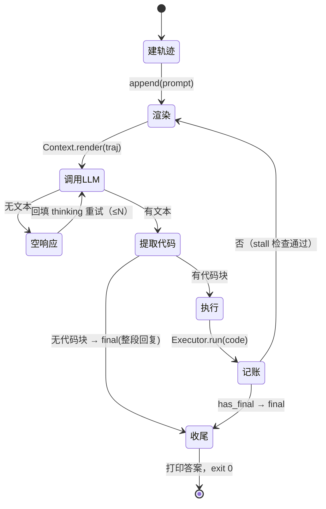

# RLM 引擎设计（shellm 等价实现）

本文是 llmcli 演进为 **shellm 等价实现** 的目标设计。它描述一个**单二进制、进程内对象**
架构的 Recursive Language Model (RLM) 引擎：模型写 bash 代码、本地执行、输出回填，循环直到
代码设置 `FINAL` / `FINAL_FILE`；同时具备 shellm 的 trajectory、context 渲染、自省与递归子 run
能力。

阅读前提：现状见 [arch.md](arch.md)（当前实现），本文只讲**目标形态与迁移路径**。会话文件格式见
[sessions.md](sessions.md)（将被 trajectory 取代，保留兼容说明）。

> 状态：**已落地**（本期范围）。沙箱（Docker）**不在本期范围**，见「非目标」。
> 实现见 `src/`：`agent.c3`（主循环）、`trajectory.c3`、`context.c3`、`llm.c3`、`runtime.c3`
> （bash Executor）。「会话文件格式」一节描述的目标形态现由 `trajectory.c3` 承担。

---

## 1. 目标与范围

**目标**：以当前代码库为基础，用等价替换的方式，做出 shellm + 其配套工具的等价实现。等价指的是
**运行时行为等价**（同一套消息构造、同一套完成信号、同一套 trajectory/context 语义），不是文件/
可执行文件形态等价。

**范围（本期）**：

- 单二进制内的 RLM 主循环（`Agent`）。
- trajectory 步骤日志（`Trajectory`）——唯一真相源。
- context 渲染（`Context`）——每轮从 trajectory 重新构造 messages。
- LLM 调用（`Llm`），仅支持 OpenAI chat completions 兼容端点（现有能力）。
- 生成代码执行器（`Executor`）——bash，含止损看门狗与 `FINAL` 捕获。
- 技能（`SkillHub`）。
- 子 run 与自省：单二进制的子命令派发。
- CLI 表面 + trajectory 落盘格式。

**非目标（后置）**：

- **沙箱**：Docker / broker / env 容器复用——后续再考虑。`Executor` 留出实现位。
- 多 provider（Anthropic / Gemini / OpenRouter）：`Llm` 只做 OpenAI 兼容，不做 provider 抽象。
- Headlong 框架层（thinkers 分发、Slack/Telegram 桥、dashboard、identity）——不属于 shellm。
- `mem`（文件式持久记忆）：它是盖在 shellm 之上的框架层工具（`mem search` 反过来调用 shellm），
  不是 RLM 引擎的一环；本期不实现。
- 持久化「持续思考」（persistent agency）——不属于 shellm 引擎。

---

## 2. 设计原则

### 2.1 为什么不需要多个工具

shellm 及其兄弟工具（`llm`/`traj`/`context`/`skills`）在 bash 里必须是独立可执行文件，
**只因为 bash 进程之间无法共享内存**——状态只能靠管道、文件、环境变量在进程间传递。这是**实现
约束，不是设计目标**。

C3 是单进程内多模块的程序：这些工具的状态（trajectory、messages、usage、技能索引）可以直接是
**进程内对象**，用函数调用交互。因此：

- **不再有「工具」边界**：`llm`/`traj`/`context`/`skills` 是模块与对象，不是可执行文件。
- **不再有跨进程胶水**：不需要 `llm --messages-file`、不需要为绕开 argv 上限把 messages 写临时
  文件、不需要用环境变量传 `TRAJ_DIR`/`TRAJ_ID`。
- **唯一的进程边界**留给「模型生成的 bash」——那是真正需要隔离与独立退出码的地方。

### 2.2 核心不变量

1. **单二进制**：一个产品就是一个可执行文件。
2. **进程内对象**：模块间直接持有对象引用；无子进程、无中间文件、无环境变量做耦合。
3. **trajectory 是唯一真相源**：每轮 messages 由 `Context` 从 `Trajectory` **重新渲染**，不是
   在内存里累加一份再顺带落盘。（这是与当前 llmcli 最本质的差别，见 [arch.md](arch.md) 3.3。）
4. **消息是投影，不是状态**：`Message[]` 是 trajectory 的一个「渲染投影」，改渲染策略不改数据。
5. **完成信号按「是否设置」判断**：`FINAL""`（空串）也算设置过；`FINAL_FILE` 优先于 `FINAL`。
6. **角色映射由策略声明**：reasoning 类步骤 → `assistant`，prompt/shell-output/feedback → `user`，
   记账类（run 元数据、summary）不进上下文。

### 2.3 等价替换总表

| shellm 里的工具/文件 | 本设计中的 C3 模块 · 对象 | 与当前代码库的关系 |
|---|---|---|
| `bin/shellm`（主循环） | `src/agent.c3` · `Agent` | **重写**：每轮从 traj 渲染，不再内存累加 |
| `bin/llm` | `src/llm.c3` · `Llm` | **新增**（仅 OpenAI 兼容）；把 `chat.c3`+`http.c3` 收入其中 |
| `bin/traj` | `src/trajectory.c3` · `Trajectory` | **由 `session.c3` 演进**：jsonl 加 step/type/run_id、fork/merge、blob spill |
| `bin/context` | `src/context.c3` · `Context` | **新增**：渲染策略对象 |
| `bin/skills` | `src/skill.c3` · `SkillHub` | **已有**，微调接入 |
| `bin/shellm-docker` | `src/sandbox.c3` · `Sandbox` | **非目标**，仅占位接口 |
| `bin/glob`/`view`/`put`/`sub` | `src/fs.c3` | **可选**：agent 面文件工具 |
| — | `src/log.c3` / `buf.c3` / `winjob.c3` | **复用**（脱敏、截断、Job Object） |
| — | `src/cli.c3` + `cmd/llmcli.c3` | **扩展**：shellm flag 集 + 子命令派发 |
| `shellm-system-prompt.txt` 装配 | `src/cli.c3` 的 prompt 装配 + `src/system_prompt.md` | **扩展**：注入 trajectory/子 run 用法段 |

---

## 3. 对象地图与依赖

```
cmd/llmcli.c3                     # main：域名派发（子命令 / 主循环）
  └─ cli.c3            Ctx         # 解析 + resolve + prompt 装配 + 子命令表
  └─ agent.c3          Agent       # RLM 主循环（重写）
       ├─ context.c3   Context     # Trajectory -> Message[]（新增）
       ├─ trajectory.c3 Trajectory # append-only 步骤日志（由 session.c3 演进）
       ├─ llm.c3       Llm         # OpenAI 兼容调用（新增；内部用 chat.c3/http.c3）
       └─ runtime.c3   Executor    # 生成 bash 的执行（改造）
  └─ skill.c3          SkillHub    # 技能（已有）
  └─ log.c3 / buf.c3               # 复用
  └─ winjob.c3                     # 复用（Ctrl+C 杀进程树）
```

依赖方向单一、无环。`Agent` 是唯一编排者；`Context` 只读 `Trajectory`，不反向依赖 `Agent`。

---

## 4. 核心对象

### 4.1 `Trajectory`（唯一真相源）

append-only 的步骤日志，持久化为 jsonl。取代并扩展当前 `session.c3`。

```
struct Trajectory
{
    String dir;        // 轨迹目录（--traj-dir / 默认）
    String id;         // 轨迹 id（首步 UUID 的 hex 前缀）
    String path;       // <dir>/<id>/trajectory.jsonl
}

// append-only，返回写入的步骤 id
fn String append(Trajectory*, Step step)

// 读取
fn Step[]  read_all(Trajectory*)
fn Step    last(Trajectory*)
fn Step?   find(Trajectory*, String step_id)

// DAG
fn String  fork(Trajectory*, String slug)     // 写 fork 步骤，返回子轨迹 id
fn void    merge(Trajectory*, String child_id) // 写 merge 步骤

// 自省（供子命令与模型使用）
fn Step[]  search(Trajectory*, String pattern)
fn Step[]  tail(Trajectory*, int n)
```

**`Step`** 是一行 JSON：

```
struct Step
{
    String step_id;   // UUID（首步即轨迹 id 的 hex 前缀来源）
    String ts;        // 本地时区 RFC3339，秒级；步骤发生时刻
    String type;      // 见下表
    String run_id;    // 产生它的 run，用于 run 作用域渲染
    String[] fields;  // 按 type 变化的具名字段（thought/cmd/stdout/exit/content…）
}
```

步骤类型（与 shellm 对齐）：

| type | 角色（默认策略） | 字段 | 说明 |
|------|------------------|------|------|
| `prompt` | user | `content` | 触发本次 run 的输入；永不截断 |
| `reasoning` | assistant | `thought`, `cmd` | 模型推理散文 + 代码块原文 |
| `shell-output` | user | `stdout`, `exit`, `feedback?` | 生成代码的执行输出 |
| `feedback` | user | `content` | 看门狗杀进程时给出的结构化反馈 |
| `final` | assistant | `content` | 最终答案 |
| `error` | — | `content`, `reason` | 中止原因（stall 等） |
| `fork` / `merge` | — | `child` / `from_traj` | 子 run 的 DAG 引用 |
| `shellm-run` / `run-summary` | 排除 | — | 记账步骤，永不进上下文 |

**落盘时机**：坚持当前 `session.c3` 的「整步一次 write、append 原子」语义；中断/报错后文件末尾
永远是完整步骤。大字段（超阈值的 stdout / content）spill 到同目录 blob 文件，步骤里存
`<field>_ref` + 字节数，渲染时按需取回（对应 shellm 的 blob 机制）。

> 兼容：现有 `.llmcli/sessions/<id>.jsonl` 的 `{ts,turn,message}` 行，可读时识别为旧格式并映射成
> `prompt`/`reasoning`/`shell-output` 步骤（迁移一次性转换，不强制）。

### 4.2 `Context`（渲染策略对象）

把 `Trajectory` 渲染为 `Message[]`。无业务副作用（读 blob 文件除外）。

```
struct RenderPolicy
{
    String[] assistant_types;  // 默认 {"reasoning","final"}
    String[] user_types;       // 默认 {"prompt","shell-output","feedback"}
    String[] exclude_types;    // 默认 {"shellm-run","run-summary"}
    String[] full_types;       // 默认 {"prompt"}：永不截断的 type
    int head;                  // 保留首 N 步（默认 1）
    int tail;                  // 保留末 N 步（默认 50）
    int tail_block;            // 尾窗起点按 B 行对齐（缓存友好；默认 1）
    usz prompt_limit;          // 普通行字段上限（默认 2048 字节）
    usz block_limit;           // 最新波段行的上限（默认 8192）
    int whole_blocks;          // 最新几个波段用 block_limit（默认 1）
    String[] pins;             // 强制包含的 step_id
    String run;                // 非空：只保留该 run 的步骤
    usz max_bytes;             // 总预算；超了二分收紧 limit
}

fn Message[] render(Context*, Trajectory*, RenderPolicy*)
```

与 shellm `bin/context` 等价的能力：head/tail/pin 窗口、角色映射、最新波段的更大截断上限、中间
截断（保留首尾、打 `[... truncated: N bytes total ...]` 桩）、`max_bytes` 预算二分、run 作用域。
（shellm 里为 Anthropic 做的连续同角色合并不需要——OpenAI 兼容端点允许连续同角色消息。）

**与现状的差别**：当前 `agent.c3` 维护内存 `List{Message}` 并只把每轮落盘当旁路。新设计里
messages 每次都由 `render` 产生，内存不保存权威副本。

### 4.3 `Llm`（OpenAI 兼容调用）

```
struct Response { String text; String reasoning; String usage; String finish_reason; bool ok; String error; }

struct Llm { String api_url; String api_key; String model; String effort; int max_tokens; }
fn Response Llm.call(Llm*, String system_prompt, Message[] messages)
```

- **仅支持 OpenAI chat completions 兼容端点**，不做 provider 抽象、不接 Anthropic/Gemini/OpenRouter。
  复用现有 `chat.c3`（`build_request`/`parse_response`）与 `http.c3`（`http_post_json`）。
- 支持 `--stop-after-code-block` 的等价：收到首个代码块闭合即可停止读取（流式后置），本期可先
  完整读取再提取。
- `reasoning_content` 仍遵守现有硬约束：**只入存档、绝不回传端点**（见 [arch.md](arch.md) 4.3）。

### 4.4 `Executor`（生成代码执行）

```
struct ExecResult { String output; int exit_code; bool has_final; String final_answer; }

struct Executor { ... }
fn ExecResult Executor.run(Executor*, String code)
```

**bash 执行**（对齐 shellm，取代当前 `run_python`）：

- 生成脚本落到临时文件后执行，模型代码原样嵌入；包装：
  `set -e` → 模型代码 → `set +e` → 按「是否设置」捕获 `FINAL`/`FINAL_FILE` → `exit 原 rc`。
- 子进程 `stdin` 接 `/dev/null`（交互式命令立即 EOF，不挂）。
- `set -x` 展示执行命令，落 trajectory 前剥离 xtrace 行（`^+ ` 前缀）。
- 输出合并 stdout+stderr，超行数截断为末 N 行，完整输出 spill 到 blob 并给路径。
- 看门狗（对齐 shellm 三个止损）：
  - **空闲**：无输出超 `inactivity_timeout` 秒 → 杀，附「疑似交互提示」结构化反馈；
  - **输出量**：累计输出超 `max_output_size` 字节 → 杀；
  - **墙钟**：运行超 `max_exec_time` 秒 → 杀。
- 进程组：执行树单开进程组，中断/Ctrl+C 时杀整棵树（复用 `winjob.c3`；POSIX 侧 v1 仍只杀直接子
  进程）。
- 平台：bash 定位（Windows 用 Git Bash / WSL 的 bash；POSIX 用 `/bin/bash`）——具体路径在实现时
  确定，本设计只固定「执行器是 bash」这一决策。

> 沙箱不在本期。`Executor` 预留为可替换实现（未来 `SandboxExecutor`），接口不变。

### 4.5 `SkillHub`（已有）

沿用 `src/skill.c3` 的发现与注入（`~/.agents/skills` 与 `<cwd>/.agents/skills`）。新增一个
`skills` 子命令读取简表。

---

## 5. 主循环

`Agent.run(ctx)` 是唯一编排入口，与 shellm 的 `main` 循环逐段对应。



伪代码：

```
run(ctx):
    traj = Trajectory.open(ctx.traj_dir, ctx.traj_id, resume=ctx.resume)
    traj.append(prompt(ctx.user_input))

    loop:
        if ctx.max_iterations > 0 and iteration > max_iterations:
            traj.append(error("max iterations")); return EXIT_UNCONVERGED

        msgs = Context.render(traj, ctx.policy)          # 内部对象，读 traj 重渲染
        resp = Llm.call(ctx.system_prompt, msgs)
        if resp.empty:
            retry with thinking fed back (≤ empty_response_retries)   # 见 4.3/5.1
            else traj.append(error); return EXIT_FAILURE

        code = extract_code(resp.text)                    # 见 5.2
        if code.empty:
            answer = resp.text
            traj.append(final(answer)); print(answer); return EXIT_OK

        exec = Executor.run(code)
        traj.append(reasoning(thought=extract_reasoning(resp.text), cmd=code))
        traj.append(shell-output(stdout=exec.output, exit=exec.exit_code))
        if exec.has_final:
            traj.append(final(exec.final_answer)); print(exec.final_answer); return EXIT_OK

        stall_guard(exec.exit_code, code)                 # 连续/重复失败 → error + return FAILURE
```

### 5.1 空响应重试

`Llm --thinking` 时，模型可能把整个输出预算花在思维链上、返回 200 但可见文本为空。此时把
thinking 作为 `assistant` 上下文回填 + 一句「继续」的 `user` 提示重试（默认 8 次）。当前 llmcli 把
空响应当未收敛退 3，本设计的重试是等价补齐。

### 5.2 代码块提取

沿用当前 `agent.c3::extract_code` 的行级扫描（第一个块、裸围栏、`python` 缀行末、块内嵌围栏不早闭、
多余块告警）。差异：围栏标记从 ```` ```python ```` 改为 shellm 的 ```` ```bash ```` / ```` ```sh ```` /
裸 ```` ``` ````；可选补上 shellm 的 `normalize_toolcall_markup`（容忍 Qwen 系 `<tool_call>` 标记）
与 heredoc 感知——本期先实现标准围栏 + heredoc 感知，标记归一化后置。

### 5.3 stall guard

连续 N 次非零退出，或同一条失败命令重复 M 次，则中止并写 `error` 步骤，避免 token 空转。

---

## 6. 系统提示词

单次装配，来源优先级与现状一致：`--system-prompt` / `--system-prompt-file` / 内置
`src/system_prompt.md`；展开 `{{date}}`/`{{cwd}}`/`{{os}}` 占位符；再追加技能列表。`--print-system-prompt`
复用同一函数（打印的就是实际发给端点的内容）。

新增段落（对齐 shellm 的 system prompt，改写为 Python-free / bash 版）：

- **工作方式**：写 bash，输出可见，循环调用直到 `FINAL`。
- **trajectory 与 context**：说明 `$TRAJ_DIR`/`$TRAJ_ID`、输出预算与截断桩、如何取回完整输出。
- **子 run**：把起子 run 作为「最有力的工具」，给出后台执行 + 读文件的范式。
- **输出预算**：最新步骤的完整上限、旧步骤只留首尾的机制。

> 这段提示词是产品的一部分，随能力一起进版本；`--help` / README / docs 三处同步（仓库约定）。

---

## 7. 子命令与子 run（单二进制）

生成代码要自省与递归时，调用的是**同一个二进制**。`cmd` 层按第一个参数派发到「命令名」：

```
llmcli shellm  "<task>"            # 起一个子 run（等价 bin/shellm）
llmcli traj    show <id> --full    # 等价 bin/traj
llmcli traj    list --children all
llmcli context --tail 100          # 等价 bin/context
llmcli skills                      # 等价 bin/skills
llmcli view / glob / put           # 可选文件工具
```

- **宿主部署**：把这些名字软链/别名到同一二进制即可（`argv[0]` 派发），部署上仍是**一个文件**。
- **子 run**：`llmcli shellm "..."` 在自己的进程里跑同一套对象，轨迹上写 `fork` 步骤、结束时写
  `merge`；父 run 用 `traj list --children` / `traj tail` 观察子 run 进度。
- **递归语义**：循环本身**不自调用**（任何一轮都只是 `Llm.call`）；递归只来自生成代码**显式**起
  子 run。这与我们此前的调用逻辑核对一致。

---

## 8. Trajectory 落盘格式

目录与文件：

```
<traj-dir>/<hex8>-<slug>/trajectory.jsonl
```

`hex8` 是首步 UUID 的前 8 位。首行是 `{"type":"trajectory"}` 头，第二行是 `shellm-run` 步骤
（命令、workdir、model、env、max-iterations 等元数据）。

一行一个 `Step`：

```json
{"step_id":"1f3a...","ts":"2026-10-10T12:00:00+08:00","type":"reasoning","run_id":"1f3a...","thought":"先看一下。","cmd":"ls -la"}
```

- `--config-dir` / `--traj-dir` 决定存放位置，**只由命令行决定，不读环境变量**（沿用现有约定）。
- 旧 `.llmcli/sessions/*.jsonl` 读取时做一次性映射（见 4.1）。

---

## 9. CLI 表面

在现有 flag 基础上扩展（新增项）：

| Flag | 作用 |
|------|------|
| `--max-iterations N` | 循环上限（现有 `--max-turns` 的更名/别名；0 或不给=不限） |
| `--traj <id>` / `--resume` | 写入/续接既有轨迹 |
| `--context-scope traj\|run` | 渲染范围（默认 traj） |
| `--traj-dir DIR` | 轨迹目录 |
| `--workdir DIR` / `--here` | 生成代码的工作目录 |
| `--system-prompt[-file]` | 已有 |
| `--var NAME[=VALUE]` | 传入生成代码的环境变量（可重复） |
| `--effort LEVEL` | 思考强度（OpenAI 兼容侧透传/可忽略） |
| `--inactivity-timeout` / `--max-output-size` / `--max-exec-time` | 看门狗阈值 |
| `--max-bytes` | context 渲染预算 |

退出码沿用现有：`0` 成功 / `1` 网络·API·协议 / `2` 用法 / `3` 未收敛 / `130` 中断。

---

## 10. 与当前 llmcli 的差异一览

| 维度 | 当前 llmcli | 目标（shellm 等价） |
|------|-------------|----------------------|
| messages 来源 | 进程内 `List{Message}` 累加 | `Context` 每轮从 trajectory 重渲染 |
| 持久化 | `--session-id` 可选旁路落盘 | trajectory 是唯一真相源，始终落盘 |
| 生成代码 | Python | bash |
| 完成信号 | `FINAL`/`FINAL_FILE`（已一致） | 同 |
| 循环止损 | `--max-turns` | max-iterations + 空闲/输出量/墙钟三看门狗 + stall guard |
| 递归 | 无 | 显式子 run + fork/merge |
| 自省 | 无 | `traj`/`context` 子命令 |
| 工具形态 | 单二进制 | 单二进制（命令群靠自派发，仍是一个文件） |
| 沙箱 | 无 | 非目标（后续） |
| provider | OpenAI 兼容 | OpenAI 兼容（不做 provider 抽象） |

---

## 11. 迁移路径（以当前文件为基）

1. **`trajectory.c3`**：从 `session.c3` 演进——加 `step_id`/`type`/`run_id`、fork/merge、blob spill；
   保留整步原子写。含旧格式读取映射。
2. **`context.c3`**：新增 `Context.render` + `RenderPolicy`（head/tail/pin、角色映射、分层截断、
   `max_bytes` 二分、run 作用域）。复用 `chat.c3::Message`。
3. **`agent.c3`**：messages 改为每轮 `Context.render(traj)`；`flush_turn` 并入 `traj.append`；补空
   响应重试、stall guard。
4. **`runtime.c3` → `Executor`**：`run_python` 改 bash 包装（`FINAL`/`FINAL_FILE`、`stdin=/dev/null`、
   xtrace 剥离、截断 + blob），加三看门狗与进程组。保留 Python 作为一个可选实现备查。
5. **`llm.c3`**：新增统一的 OpenAI 兼容调用入口，把 `chat.c3`+`http.c3` 收进来；不做 provider 抽象。
6. **`cli.c3` + `cmd/llmcli.c3`**：扩 flag 集 + 系统提示词新段落 + 子命令派发；`HELP` 同步。
7. 收尾：更新 [sessions.md](sessions.md)（并入 trajectory 语义）、README 文档索引、`AGENTS.md`。

**测试**：单元测试扩到 `extract_code`(bash)、`Context.render`（角色/窗口/截断/预算）、`Trajectory`
（append/load/fork/merge/spill 往返）；端到端回归扩到 trajectory 与子 run 场景（沿用
[ci.md](ci.md) 的离线 mock 端点思路）。

---

## 12. 术语表

| 术语 | 含义 |
|------|------|
| **RLM** | Recursive Language Model：模型写代码、本地执行、输出回填的循环范式 |
| **run** | 一次 `Agent.run`，即一条 trajectory 的一次执行 |
| **iteration** | run 内的一次 LLM 往返（对应当前 Trace 的 turn） |
| **trajectory** | append-only 的步骤日志，run 的唯一真相源 |
| **step** | trajectory 里的一条记录（prompt/reasoning/shell-output/final/…） |
| **context** | 从 trajectory 渲染出的 messages 投影 |
| **sub-run** | 生成代码显式起的子进程 run，在父轨迹上是 fork/merge 分支 |
| **FINAL / FINAL_FILE** | 生成代码里设置完成信号的变量 |

---

## 13. 与现有文档的关系

- [arch.md](arch.md)：当前实现的架构；本文是其目标演进。
- [sessions.md](sessions.md)：当前会话文件格式；目标形态并入 trajectory（第 8 节）。
- [ci.md](ci.md)：非交互与超时；目标形态下 CI 仍用外部超时 + `--max-iterations`。
- [skills.md](skills.md)：技能发现与注入，`SkillHub` 沿用。
